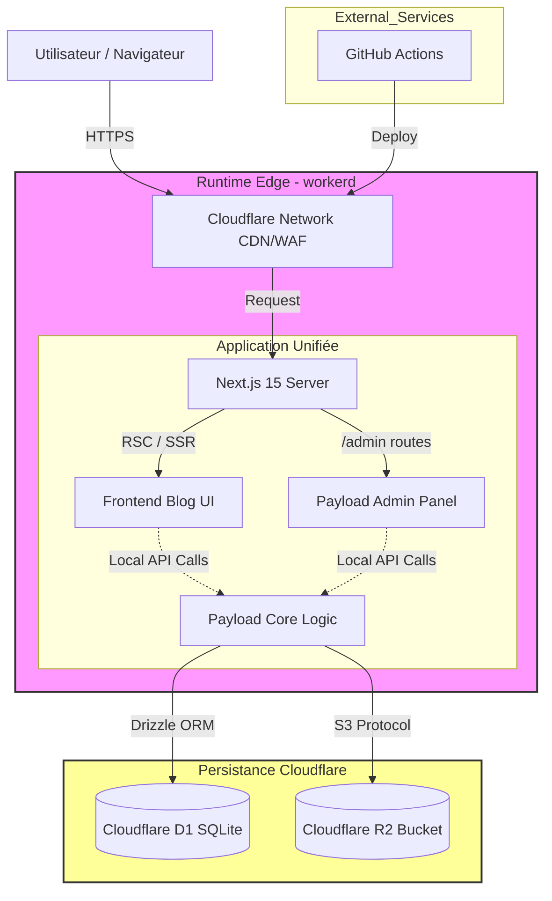

## Introduction et Modèle de Démarrage

- **Projet :** sebc.dev
- **Type :** Blog technique & CMS Headless (Architecture unifiée).
- **Référence technique :** Le PRD mentionne explicitement l'utilisation du template officiel `with-cloudflare-d1`.

## Architecture de Haut Niveau

### Résumé Technique

Le système sebc.dev est une application Fullstack Serverless unifiée. Elle repose sur Next.js 15 (App Router) hébergé sur Cloudflare Workers. L'application intègre Payload CMS 3.0 directement dans le runtime Next.js, fonctionnant comme un "monolithe logique".

L'architecture élimine la latence réseau interne en privilégiant les appels de fonctions directs (Local API) entre le Front-end (React Server Components) et le CMS, plutôt que des appels HTTP REST/GraphQL. La persistance est assurée par Cloudflare D1 (SQLite distribué) pour les données relationnelles et Cloudflare R2 pour les médias, garantissant une exécution 100% Edge sans conteneurs ni serveurs d'origine.

### Choix de la Plateforme et Infrastructure

- **Plateforme :** Cloudflare (Workers & Pages architecture unifiée via `@opennextjs/cloudflare`).
- **Services Clés :**
  - **Compute :** Cloudflare Workers (Runtime `workerd`, `nodejs_compat`).
  - **Base de données :** Cloudflare D1 (via Drizzle ORM).
  - **Stockage Objets :** Cloudflare R2 (via Payload Cloud Storage Plugin).
  - **Cache/CDN :** Cloudflare Global Network + Next.js Cache API.
- **Régions de déploiement :** Edge (Distribué mondialement, "Smart Placement" activé pour D1 si nécessaire).

### Structure du Répertoire

Nous adoptons une structure de **Monorepo Logique (Single Repo)**. Contrairement à un monorepo avec workspaces (Nx/Turbo), le code du CMS et du Front-end réside dans la même application Next.js pour simplifier le partage de types et le déploiement atomique.

- **Structure :** Single Next.js App.
- **Organisation :** Dossiers `/app` (Front), `/app/(payload)` (Admin), et `/src` partagé.

### Diagramme d'Architecture (Haut Niveau)



### Patrons Architecturaux

- **Edge-First Architecture :** Tous les composants, y compris le CMS, doivent être compatibles avec le runtime Edge. Cela interdit l'usage de dépendances Node.js natives (C++ bindings) comme `sharp` standard.
- **Local API First :** Le Front-end récupère les données via `payload.find()` directement côté serveur, évitant la sérialisation JSON et les "round-trips" HTTP internes.
- **Single Source of Truth (Schema) :** Le schéma de base de données est défini et géré uniquement par les configurations TypeScript de Payload (`payload.config.ts`), synchronisé vers D1 via Drizzle.
- **Incremental Static Regeneration (ISR) :** Utilisation agressive du cache Next.js (`unstable_cache`), invalidé par les Hooks `afterChange` de Payload pour garantir la fraîcheur du contenu (< 60s Time-to-Value).
- **Cold Start Optimization :** Minimisation de l'impact du démarrage à froid des Workers via une stratégie de cache multi-couches détaillée ci-dessous.

### Stratégie d'Optimisation Cold Start (Multi-Couches)

L'optimisation des cold starts repose sur le paradigme **"Compute Avoidance"** : la méthode la plus efficace pour éliminer la latence du démarrage à froid consiste à ne pas démarrer le Worker du tout pour les lecteurs anonymes.

#### Couche 1 : Cache Rules Cloudflare (Niveau Réseau)

**Principe** : Dichotomie stricte Lecteur / Éditeur. Les utilisateurs non authentifiés (99% du trafic) doivent percevoir le site comme une application statique.

| Critère de Correspondance        | Action                    | TTL Edge         | Justification                                      |
| -------------------------------- | ------------------------- | ---------------- | -------------------------------------------------- |
| Cookie contient `payload-token`  | **Bypass Cache**          | N/A              | Admins voient toujours les données en temps réel   |
| Méthode HTTP ≠ GET               | **Bypass Cache**          | N/A              | Mutations (POST, PUT, DELETE) atteignent le Worker |
| URI commence par `/_next/static` | **Cache**                 | 1 an (Immutable) | Assets versionnés par Next.js                      |
| Extensions images                | **Cache**                 | 1 an (Immutable) | Assets statiques                                   |
| **Défaut** (HTML, JSON RSC)      | **Cache Override Origin** | 1 mois           | Force le cache du HTML/JSON public                 |

> **Important** : L'option "Override Origin" est indispensable car Next.js 15 émet par défaut des headers `Cache-Control` conservateurs (`private`, `max-age=0`) pour les routes dynamiques.

#### Couche 2 : Cache Incrémental OpenNext (Niveau Application)

**Configuration requise** (`open-next.config.ts`) :

```typescript
import { defineCloudflareConfig } from '@opennextjs/cloudflare'
import kvIncrementalCache from '@opennextjs/cloudflare/overrides/incremental-cache/kv-incremental-cache'

export default defineCloudflareConfig({
  incrementalCache: kvIncrementalCache, // KV pour faible latence
  queue: {
    type: 'durable-object', // Fiable pour revalidation ISR
  },
})
```

**Rationale** : Workers KV offre une latence minimale (eventually consistent) idéale pour le cache HTML/JSON. Lors d'un cold start, le Worker peut servir une page pré-générée depuis KV sans réexécuter la logique de rendu.

#### Couche 3 : Initialisation Payload Optimisée (Niveau Code)

**Pattern Singleton Impératif** (`src/lib/payload.ts`) :

```typescript
import { getPayload } from 'payload'
import config from '@payload-config'

let cachedPayload = null

export const getPayloadClient = async () => {
  if (cachedPayload) return cachedPayload

  // Initialisation coûteuse : seulement au cold start
  cachedPayload = await getPayload({ config })
  return cachedPayload
}
```

**Optimisations complémentaires** :

- **Lazy-loading des plugins** : Utiliser des imports dynamiques (`await import()`) dans les Hooks Payload pour différer le chargement du code lourd (traitement d'image, génération PDF).
- **Audit du bundle** : Maintenir la taille du bundle < 1-2 Mo pour le chemin critique (limite Workers : 10 Mo compressé, mais dégradation avant).
- **Exclusion des packages lourds** : Utiliser `serverExternalPackages` dans `next.config.js` pour les dépendances non nécessaires au bundling.

#### Couche 4 : Invalidation & Revalidation

**Workflow** :

1. Éditeur modifie un article dans Payload Admin
2. Hook `afterChange` déclenche `revalidateTag('collection-posts')`
3. OpenNext purge les entrées correspondantes dans KV
4. Prochaine requête lecteur : cache miss → Worker génère → nouveau cache

> **Documentation technique complète** : [Cold Start Optimization Report](../tech/cloudflare/cold-start-optimization.md)

## Tech Stack (Choix Technologiques)

Cette table constitue la source de vérité unique pour les agents de développement.

### Matrice de Compatibilité et Versions Validées (Novembre 2025)

| **Catégorie**       | **Composant**          | **Version Validée**  | **Configuration & Justification Critique**                                                                                     |
| ------------------- | ---------------------- | -------------------- | ------------------------------------------------------------------------------------------------------------------------------ |
| **Framework**       | **Next.js**            | **15.5.x (LTS)**     | Version la plus stable supportant React 19. Évite les conflits de bundler (Turbopack) observés sur la v16 avec Payload.        |
| **CMS**             | **Payload CMS**        | **3.65.x (Stable)**  | Version de production impérative. Nécessite le flag `nodejs_compat` sur Cloudflare pour fonctionner.                           |
| **Core UI**         | **React**              | **19.2.x**           | Requis par Next.js 15. Introduit les nouvelles API de formulaires (`useActionState`) et la gestion simplifiée des `ref`.       |
| **Styling**         | **Tailwind CSS**       | **4.0.x (Stable)**   | Utilise le nouveau moteur Oxide (écrit en Rust). Configuration désormais via CSS (`@theme`) et non plus `tailwind.config.js`.  |
| **Composants**      | **shadcn/ui**          | **Latest (v4)**      | Doit être initialisé avec le support Tailwind v4. Les composants ne doivent plus utiliser `forwardRef` (déprécié en React 19). |
| **ORM**             | **Drizzle ORM**        | **0.44.x**           | Version requise pour le pilote HTTP D1 optimisé. Les versions 0.30.x sont obsolètes et moins performantes sur l'Edge.          |
| **i18n**            | **next-intl**          | **4.5.x**            | Indispensable pour la compatibilité avec les API asynchrones de Next.js 15 (`await params`).                                   |
| **Runtime**         | **Cloudflare Workers** | **workerd (Latest)** | Doit être configuré avec `compatibility_flags = ["nodejs_compat"]` dans `wrangler.toml` pour supporter Payload.                |
| **Base de Données** | **Cloudflare D1**      | **(SaaS)**           | Utiliser `@payloadcms/db-sqlite` en mode production avec le driver Drizzle D1.                                                 |
| **Stockage**        | **Cloudflare R2**      | **(SaaS)**           | Obligatoire pour la persistance des médias Payload (le disque local Workers étant éphémère).                                   |
| **Langage**         | **TypeScript**         | **5.7.x**            | Nécessaire pour le typage correct des Server Actions et des schémas Drizzle.                                                   |
| **Package Manager** | **pnpm**               | **Latest**           | Recommandé par Payload pour sa gestion efficace des dépendances monorepo et sa rapidité.                                       |

## Modèles de Données

Nous définissons ici les entités principales. Le schéma Payload sera la source de vérité.

### Core Content

- **Articles (Posts)**
  - **But :** Contenu principal du blog.
  - **Attributs Clés :**
    - `title` (Localized, Text) : Titre H1.
    - `slug` (Localized, Text) : URL canonique.
    - `content` (Localized, Rich Text Lexical) : Corps de l'article.
    - `excerpt` (Localized, Textarea) : Résumé pour les cartes.
    - `publishedAt` (Date) : Pour le tri et la publication différée.
    - `readingTime` (Number) : Calculé via Hook `beforeChange`.
    - `difficulty` (Select) : 'Junior', 'Mid', 'Senior' (pour filtrage).
  - **Relations :**
    - `authors` (Relation -> Users, many-to-many).
    - `category` (Relation -> Categories, many-to-one).
    - `tags` (Relation -> Tags, many-to-many).
    - `relatedPosts` (Relation -> Posts, many-to-many, self-referencing).
- **Pages**
  - **But :** Pages statiques (A propos, Mentions légales, etc.).
  - **Attributs Clés :** `title` (Loc), `slug` (Loc), `layout` (Blocks).
  - **Note :** Utilisation de "Blocks" pour une mise en page flexible différente des articles.

### Taxonomie & Média

- **Catégories (Categories)**
  - **But :** Structure thématique principale (ex: "Tutoriel", "Rétrospective").
  - **Attributs Clés :**
    - `title` (Localized, Text).
    - `slug` (Text).
    - **Config UI :** `color` (Text/ColorPicker), `icon` (Upload/Media) pour l'identité dynamique.
- **Étiquettes (Tags)**
  - **But :** Filtrage transversal (ex: "Next.js", "AI", "Cloudflare").
  - **Attributs Clés :** `title` (Text), `slug` (Text).
- **Media**
  - **But :** Gestion des assets (Images, Vidéos).
  - **Stockage :** Cloudflare R2 via plugin S3.
  - **Attributs :** `alt` (Localized, Text), `caption` (Localized, Rich Text).
- **Utilisateurs (Users)**
  - **But :** Accès Admin uniquement (V1).
  - **Attributs :** Email, Password, Name, Role ('admin').

## Composants Logiques

Dans notre architecture "Monolithe Logique", la distinction Front/Back est floue. Nous découpons plutôt par responsabilité : **UI (RSC)**, **CMS Core** et **Shared Kernel**.

### UI & Pages (Next.js App Router)

- **Root Layout (`layout.tsx`) :** Gère le `<html>`, la police (Inter/JetBrains), le `ThemeProvider` (Dark mode) et l'initialisation de l'i18n.
- **Blog Layout :** Wrapper pour la navigation (Header/Footer) et la gestion du Scroll Progress (Story 4.2).
- **Page Components (RSC) :**
  - `HomePage` : Fetch les derniers articles via Local API.
  - `PostPage` : Fetch le contenu, génère les métadonnées SEO, rend le MDX/Lexical.
  - `SearchHub` : Client Component (seule exception majeure) pour la gestion d'état des filtres (Story 5.2).
- **Design System (`/components/ui`) :**
  - Implémentation atomique de `shadcn/ui` (Button, Card, Badge).
  - Adaptation Tailwind v4 (CSS variables natives).

### CMS Core (Payload Config)

- **Collection Configs :** Définitions TypeScript des schémas (Articles, Pages, Users...).
- **Lexical Adapter :** Configuration de l'éditeur riche, sérialiseurs HTML/React pour le frontend.
- **Hooks :**
  - `afterChange` : Déclenche `revalidateTag` (Next.js) pour purger le cache ISR.
  - `beforeChange` : Calcule le "Temps de lecture" automatiquement.
- **Storage Adapter :** Connecteur R2 pour les uploads.

### Shared Kernel (`/lib`)

- **Payload Client :** Singleton pour initialiser `getPayload()` (Local API).
- **Drizzle Schema :** Définitions SQL exportées pour Payload ET pour les requêtes custom optimisées
- **Utils :** Helpers pour les dates, formatage de chaînes, et configuration i18n (`navigation.ts`).

## Flux de Données & Workflows

Le point critique ici est l'interaction **Local API**. Voici comment les données circulent sans quitter le Worker.

#### Diagramme de Séquence : Affichage d'un Article (Server-Side)

```mermaid
sequenceDiagram
    participant User
    participant Edge as Cloudflare Worker
    participant Page as Next.js Page (RSC)
    participant LocalAPI as Payload Local API
    participant DB as D1 Database

    User->>Edge: GET /fr/posts/mon-super-article
    Edge->>Page: Invoke Server Component

    rect rgb(20, 20, 30)
        note right of Page: Exécution interne (Pas de HTTP)
        Page->>LocalAPI: payload.find({ slug, locale: 'fr' })
        LocalAPI->>DB: Drizzle SQL Query (Prepared Statement)
        DB-->>LocalAPI: Raw Data (JSON)
        LocalAPI-->>Page: Typed Data (Article)
    end

    Page->>Page: Render Lexical to JSX
    Page-->>Edge: HTML Stream
    Edge-->>User: Response (Cache-Control: public...)
```



**Pourquoi c'est performant :** La boîte noire "Exécution interne" se passe dans la mémoire du même Worker. Il n'y a aucun délai de latence réseau (0ms round-trip) entre le composant React et le moteur du CMS.

#### Workflow de Déploiement & Migrations

- **Validation Locale :** Les migrations Drizzle doivent impérativement être testées via `wrangler d1 execute --local` avant tout push, D1 étant plus restrictif que SQLite standard sur les modifications de schéma.
- **Pipeline CI/CD :** Le déploiement (`wrangler deploy`) est conditionné au succès de la migration de la base de données de staging.

## 6. Sécurité du Pipeline CI/CD

### 6.1 Modèle de Menaces

Dans un projet utilisant la génération de code par IA, les vecteurs d'attaque critiques sont :

1. **Supply Chain Attacks** : Injection de dépendances malveillantes via hallucinations IA (paquets npm inexistants ou typosquatting)
2. **Code Quality Drift** : Accumulation de code mort, imports cassés, violations d'architecture générés par l'IA
3. **Secret Exposure** : Fuite de credentials Cloudflare (API tokens, account ID) dans les logs ou via compromission de secrets statiques

> **Détails complets :** [CI-CD Security Architecture](./CI-CD-Security.md)

### 6.2 Défense en Profondeur (Layered Security)

```
┌─────────────────────────────────────────────────────────┐
│ Layer 1: Supply Chain (Socket.dev + SHA Pinning)       │
│          → Analyse comportementale (pas seulement CVE)  │
│          → Config socket.yml v2 avec triggerPaths       │
│          → Politique Block/Warn/Monitor différenciée    │
├─────────────────────────────────────────────────────────┤
│ Layer 2: Code Quality (Knip + ESLint + Type Sync)      │
│          → Détecte hallucinations, code mort, drift     │
├─────────────────────────────────────────────────────────┤
│ Layer 3: Build Validation (Next.js no-DB mode)         │
│          → Garantit buildabilité sans runtime deps      │
├─────────────────────────────────────────────────────────┤
│ Layer 4: Identity (OIDC)                               │
│          → Élimine secrets statiques, limite blast      │
└─────────────────────────────────────────────────────────┘
```

#### Spécificité Layer 2 : Analyse Statique et Frameworks Convention-Based

Next.js 15 (App Router) et Payload CMS 3.0 reposent sur une **inversion de contrôle** : le framework appelle votre code via des fichiers aux noms conventionnels (`page.tsx`, `layout.tsx`, `payload.config.ts`). Pour un analyseur statique comme Knip, ces fichiers apparaissent comme du code mort car aucun fichier du projet ne les importe explicitement.

La configuration Knip doit donc explicitement déclarer ces **points d'entrée implicites** :

- **Next.js 15** : `page.tsx`, `layout.tsx`, `route.ts`, `middleware.ts`, `instrumentation.ts`
- **Payload CMS** : `payload.config.ts` (point d'entrée absolu de toute la logique CMS)
- **Drizzle** : `drizzle.config.ts` + exclusion du dossier `migrations/` (fichiers SQL jamais importés)

> **Configuration détaillée** : Voir [CI-CD Security - Section 3.1](./CI-CD-Security.md#31-knip---détection-de-code-mort)

### 6.3 Quality Gate Workflow

**Stratégie de déclenchement** : Workflows déclenchés **manuellement** (`workflow_dispatch`) mais **obligatoires** pour merger via branch protection.

Le déploiement Cloudflare est **strictement conditionné** à la réussite de tous les checks :

```yaml
# Workflow simplifié
name: Quality Gate
on:
  workflow_dispatch:
    inputs:
      run_mutation_tests:
        description: 'Exécuter Stryker (mutation testing)'
        type: boolean
        default: false

jobs:
  quality-gate:
    steps:
      # Supply Chain
      - Socket.dev (blocker)
      - SHA pinning verification

      # Code Quality
      - Knip (dead code)
      - Type sync (Payload)
      - ESLint + Prettier
      - dependency-cruiser

      # Build & Tests
      - next build --experimental-build-mode compile
      - Vitest (unit + integration)
      - Playwright + axe-core (E2E + a11y)

      # Performance (après déploiement preview)
      - Wait for Preview URL (pattern wait-for-url obligatoire)
      - Lighthouse CI (métriques brutes: LCP, CLS, TBT, FCP)

      # Mutation Testing (optionnel)
      - Stryker (si input activé)

  deploy:
    needs: quality-gate
    # OIDC authentication (pas de secrets statiques)
    - wrangler deploy
```

### 6.4 Principes de Sécurité Appliqués

| Principe             | Implémentation                                                  | Rationale                                           |
| -------------------- | --------------------------------------------------------------- | --------------------------------------------------- |
| **Least Privilege**  | GITHUB_TOKEN en read-only par défaut                            | Limite le blast radius d'une compromission          |
| **Immutability**     | SHA pinning des actions tierces                                 | Garantie cryptographique de l'intégrité du code     |
| **Defense in Depth** | 4 layers de validation (supply chain, quality, build, identity) | Une couche échouée ne compromet pas tout le système |
| **Keyless Auth**     | OIDC pour Cloudflare                                            | Élimine le risque de vol de secrets statiques       |
| **Manual Trigger**   | `workflow_dispatch` + branch protection                         | Évite exécutions répétées, contrôle développeur     |

### 7. Structure du Projet Unifié

Nous adaptons la structure du template `with-cloudflare-d1` pour y intégrer nos besoins i18n et l'architecture unifiée.

```
sebc-dev/
├── .github/workflows/          # CI/CD (Quality Gate)
├── src/
│   ├── app/                    # Next.js App Router
│   │   ├── (frontend)/         # Site Public
│   │   │   ├── [locale]/       # i18n Routing (fr/en)
│   │   │   │   ├── posts/
│   │   │   │   ├── search/
│   │   │   │   └── page.tsx    # Homepage
│   │   │   └── layout.tsx      # Root Layout (Fonts, Providers)
│   │   ├── (payload)/          # CMS Admin & API
│   │   │   ├── admin/          # Admin Panel SPA
│   │   │   └── api/            # API REST (pour Admin UI)
│   ├── components/
│   │   ├── ui/                 # shadcn/ui primitives
│   │   ├── blocks/             # Lexical Renderers
│   │   └── layout/             # Header, Footer
│   ├── lib/
│   │   ├── payload.ts          # Local API Client Singleton
│   │   ├── i18n.ts             # next-intl config
│   │   └── utils.ts            # cn() helper
│   ├── messages/               # Traductions UI (en.json, fr.json)
│   ├── payload/                # CMS Configuration
│   │   ├── collections/        # Definitions Schema
│   │   └── payload.config.ts   # Config Maître
│   ├── styles/
│   │   └── globals.css         # Tailwind v4 Configuration (Vars)
│   └── migrations/             # Drizzle SQL
├── public/                     # Static Assets
├── next.config.mjs
├── wrangler.toml               # Cloudflare Infrastructure Config
└── package.json
```
