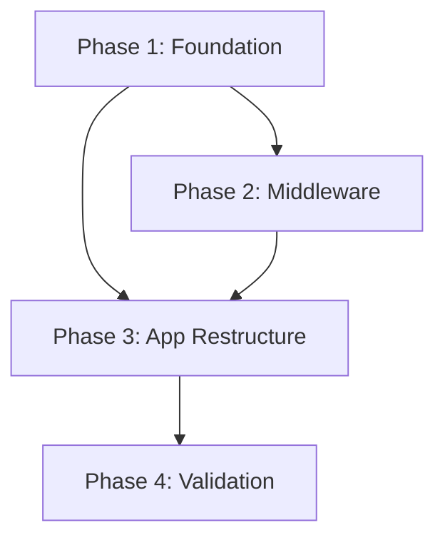

# Story 3.1: Routing i18n & Middleware - Phases Plan

## Story Overview

**Epic**: 3 - Frontend Core & Design System
**Story**: 3.1 - Routing i18n & Middleware
**Complexity**: Medium
**Total Phases**: 4
**Estimated Duration**: 4-6 days
**Estimated Commits**: 12-16

---

## Executive Summary

Cette story implémente le routing i18n frontend avec `next-intl` pour Next.js 15 App Router. Le backend Payload CMS dispose déjà de la configuration i18n (FR/EN), cette story établit le pont côté frontend.

### Key Deliverables

1. Installation et configuration de `next-intl`
2. Middleware de détection/routing des locales
3. Restructuration de l'app directory avec segment `[locale]`
4. Fichiers de messages de base (structure)
5. Tests E2E du routing i18n

### Success Criteria

- URLs `/fr/*` et `/en/*` fonctionnelles
- Détection automatique de la langue navigateur
- Persistance via cookie `NEXT_LOCALE`
- Attribut `lang` dynamique sur `<html>`
- Compatible Cloudflare Workers

---

## Phase Breakdown Strategy

### Sizing Rationale

| Factor | Assessment |
|--------|------------|
| Technical Complexity | Medium - next-intl est bien documenté mais App Router setup est spécifique |
| Files Affected | ~15-20 fichiers (nouveau + restructuration) |
| Risk Level | Medium - restructuration app directory peut casser le routing |
| Dependencies | Low - peu de dépendances internes |
| Testing Needs | High - routing critique pour toute l'app |

### Phase Distribution

```
Phase 1: Foundation (Configuration & Installation)
    ├── Install next-intl
    ├── Create i18n configuration
    └── Setup message files structure

Phase 2: Middleware & Routing
    ├── Create middleware.ts
    ├── Configure locale detection
    └── Handle cookie persistence

Phase 3: App Directory Restructure
    ├── Create [locale] segment
    ├── Move frontend routes
    └── Update layouts with locale context

Phase 4: Validation & E2E Tests
    ├── E2E tests for routing
    ├── Integration tests
    └── Cloudflare Workers validation
```

---

## Phases Summary

### Phase 1: Foundation - Configuration & Installation

**Objective**: Installer `next-intl` et créer la configuration i18n de base.

**Duration**: 1 day
**Commits**: 3-4
**Risk**: Low
**Complexity**: Low

#### Deliverables

| Deliverable | Description |
|-------------|-------------|
| Package installation | `next-intl` ajouté aux dépendances |
| i18n config | Configuration des locales et routing |
| Message files | Structure JSON pour FR/EN |
| TypeScript types | Types pour les messages |

#### Files Affected

| File | Action | Purpose |
|------|--------|---------|
| `package.json` | Modify | Add next-intl dependency |
| `src/i18n/config.ts` | Create | Locales and default locale config |
| `src/i18n/routing.ts` | Create | Routing configuration (pathnames) |
| `src/i18n/request.ts` | Create | Server-side i18n request config |
| `messages/fr.json` | Create | French translations (minimal) |
| `messages/en.json` | Create | English translations (minimal) |
| `global.d.ts` | Create/Modify | TypeScript message types |

#### Dependencies

- None (first phase)

#### Success Criteria

- [ ] `pnpm install` succeeds with next-intl
- [ ] TypeScript compiles without errors
- [ ] Configuration files pass lint checks

#### Technical Notes

- Use next-intl v4.x for App Router support
- Keep message files minimal (navigation, common labels only)
- Configure `localePrefix: 'always'` for consistent URLs

---

### Phase 2: Middleware & Routing

**Objective**: Implémenter le middleware Next.js pour la détection et le routing des locales.

**Duration**: 1-2 days
**Commits**: 3-4
**Risk**: Medium
**Complexity**: Medium

#### Deliverables

| Deliverable | Description |
|-------------|-------------|
| Middleware | Détection locale et redirection |
| Cookie handling | Persistance NEXT_LOCALE |
| Route matching | Exclude admin/api routes |

#### Files Affected

| File | Action | Purpose |
|------|--------|---------|
| `middleware.ts` | Create | Main middleware at project root |
| `src/i18n/routing.ts` | Modify | Add matcher configuration |
| `next.config.ts` | Modify | Add i18n-related config if needed |

#### Dependencies

- Phase 1 (config files)

#### Success Criteria

- [ ] Visiting `/` redirects to `/fr` or `/en` based on browser
- [ ] Cookie `NEXT_LOCALE` is set on first visit
- [ ] Returning visitors use cookie preference
- [ ] `/admin/*` routes are NOT affected
- [ ] `/api/*` routes are NOT affected
- [ ] Middleware executes in < 50ms

#### Technical Notes

```typescript
// Middleware matcher pattern
export const config = {
  matcher: [
    // Match all pathnames except:
    // - /api (API routes)
    // - /admin (Payload admin)
    // - /_next (Next.js internals)
    // - /.*\\..* (files with extensions)
    '/((?!api|admin|_next|.*\\..*).*)',
  ],
};
```

#### Risk Mitigation

- Test middleware locally before deployment
- Verify Cloudflare Workers compatibility
- Keep matcher pattern simple and explicit

---

### Phase 3: App Directory Restructure

**Objective**: Restructurer l'app directory avec le segment dynamique `[locale]` et mettre à jour les layouts.

**Duration**: 1-2 days
**Commits**: 4-5
**Risk**: High
**Complexity**: High

#### Deliverables

| Deliverable | Description |
|-------------|-------------|
| [locale] segment | Dynamic route segment for locales |
| Locale layout | Root layout with locale provider |
| Frontend layout | Locale-aware frontend layout |
| HomePage migration | Move and update homepage |

#### Files Affected

| File | Action | Purpose |
|------|--------|---------|
| `src/app/[locale]/layout.tsx` | Create | Root locale layout with providers |
| `src/app/[locale]/(frontend)/layout.tsx` | Create | Frontend layout (from existing) |
| `src/app/[locale]/(frontend)/page.tsx` | Create | HomePage (from existing) |
| `src/app/(frontend)/layout.tsx` | Delete | Replaced by locale version |
| `src/app/(frontend)/page.tsx` | Delete | Replaced by locale version |
| `src/app/(frontend)/styles.css` | Move | To [locale]/(frontend)/ |

#### Dependencies

- Phase 1 (config files)
- Phase 2 (middleware)

#### Success Criteria

- [ ] `/fr` displays French homepage
- [ ] `/en` displays English homepage
- [ ] `<html lang="fr">` or `<html lang="en">` is correct
- [ ] No 404 errors on existing routes
- [ ] `/admin` still accessible and functional
- [ ] Build succeeds without errors

#### Technical Notes

**Directory Structure After Restructure**:
```
src/app/
├── [locale]/
│   ├── layout.tsx              # NextIntlClientProvider + html lang
│   └── (frontend)/
│       ├── layout.tsx          # Frontend-specific layout
│       ├── page.tsx            # HomePage
│       └── styles.css
└── (payload)/                  # Unchanged
    ├── admin/
    └── api/
```

**Root Layout Pattern**:
```typescript
// src/app/[locale]/layout.tsx
import { NextIntlClientProvider } from 'next-intl';
import { getMessages, setRequestLocale } from 'next-intl/server';
import { routing } from '@/i18n/routing';

export function generateStaticParams() {
  return routing.locales.map((locale) => ({ locale }));
}

export default async function LocaleLayout({
  children,
  params,
}: {
  children: React.ReactNode;
  params: Promise<{ locale: string }>;
}) {
  const { locale } = await params;
  setRequestLocale(locale);
  const messages = await getMessages();

  return (
    <html lang={locale}>
      <body>
        <NextIntlClientProvider messages={messages}>
          {children}
        </NextIntlClientProvider>
      </body>
    </html>
  );
}
```

#### Risk Mitigation

- Backup existing files before deletion
- Test each route after migration
- Verify admin panel accessibility immediately
- Use git to track all changes for easy rollback

---

### Phase 4: Validation & E2E Tests

**Objective**: Valider l'implémentation complète avec des tests E2E et vérifier la compatibilité Cloudflare.

**Duration**: 1 day
**Commits**: 2-3
**Risk**: Low
**Complexity**: Medium

#### Deliverables

| Deliverable | Description |
|-------------|-------------|
| E2E tests | Playwright tests for i18n routing |
| Integration tests | Vitest tests for utilities |
| Build validation | Verify production build |
| Workers validation | Test on Cloudflare preview |

#### Files Affected

| File | Action | Purpose |
|------|--------|---------|
| `tests/e2e/i18n-routing.e2e.spec.ts` | Create | E2E routing tests |
| `tests/int/i18n-config.int.spec.ts` | Create | Configuration tests |

#### Dependencies

- Phases 1-3 (complete implementation)

#### Success Criteria

- [ ] All E2E tests pass
- [ ] `pnpm build` succeeds
- [ ] `pnpm test` passes
- [ ] Cloudflare preview deployment works
- [ ] No console errors in browser

#### Test Scenarios

```typescript
// E2E Test Scenarios
describe('i18n Routing', () => {
  test('redirects root to default locale', async () => {
    // Visit / → expect redirect to /fr
  });

  test('respects browser language preference', async () => {
    // Set Accept-Language: en → expect redirect to /en
  });

  test('persists locale in cookie', async () => {
    // Visit /en → check NEXT_LOCALE cookie = 'en'
  });

  test('uses cookie preference on return visit', async () => {
    // Set cookie, visit / → expect redirect to cookie locale
  });

  test('sets correct html lang attribute', async () => {
    // Visit /fr → expect <html lang="fr">
    // Visit /en → expect <html lang="en">
  });

  test('admin routes are not affected', async () => {
    // Visit /admin → expect Payload admin (no /fr/admin)
  });
});
```

---

## Implementation Order & Dependencies



### Dependency Matrix

| Phase | Depends On | Blocks |
|-------|------------|--------|
| Phase 1 | None | Phase 2, Phase 3 |
| Phase 2 | Phase 1 | Phase 3 |
| Phase 3 | Phase 1, Phase 2 | Phase 4 |
| Phase 4 | Phase 1, 2, 3 | None |

### Recommended Execution Order

1. **Phase 1** - Can start immediately
2. **Phase 2** - Start after Phase 1 config is complete
3. **Phase 3** - Start after middleware is working
4. **Phase 4** - Final validation after all phases

---

## Timeline & Resource Estimation

### Timeline

| Phase | Duration | Cumulative |
|-------|----------|------------|
| Phase 1 | 1 day | Day 1 |
| Phase 2 | 1-2 days | Day 2-3 |
| Phase 3 | 1-2 days | Day 3-5 |
| Phase 4 | 1 day | Day 4-6 |

**Total**: 4-6 days

### Commit Distribution

| Phase | Commits | Description |
|-------|---------|-------------|
| Phase 1 | 3-4 | Package, config, messages, types |
| Phase 2 | 3-4 | Middleware, routing, cookie handling |
| Phase 3 | 4-5 | Layout, pages, cleanup, integration |
| Phase 4 | 2-3 | Tests, validation, fixes |

**Total**: 12-16 commits

---

## Risk Assessment

### Phase 1 Risks

| Risk | Probability | Impact | Mitigation |
|------|-------------|--------|------------|
| Package compatibility | Low | Medium | Use stable next-intl version |
| TypeScript errors | Low | Low | Follow official types guide |

### Phase 2 Risks

| Risk | Probability | Impact | Mitigation |
|------|-------------|--------|------------|
| Middleware breaks admin | Medium | High | Explicit matcher exclusion |
| Cookie not persisting | Low | Medium | Test in multiple browsers |
| Workers incompatibility | Medium | High | Test early on Cloudflare preview |

### Phase 3 Risks

| Risk | Probability | Impact | Mitigation |
|------|-------------|--------|------------|
| Routes break | High | High | Incremental migration, git tracking |
| Lost styles | Medium | Medium | Careful file moving |
| Build failures | Medium | High | Test build after each change |

### Phase 4 Risks

| Risk | Probability | Impact | Mitigation |
|------|-------------|--------|------------|
| Flaky tests | Medium | Low | Robust test selectors |
| Preview issues | Low | Medium | Local preview first |

### Overall Risk Level: MEDIUM

Primary concerns:
1. App directory restructure (Phase 3) - highest risk
2. Cloudflare Workers middleware compatibility

---

## Testing Strategy

### Test Types by Phase

| Phase | Unit | Integration | E2E |
|-------|------|-------------|-----|
| Phase 1 | Config validation | - | - |
| Phase 2 | Cookie utils | Middleware behavior | - |
| Phase 3 | - | Layout rendering | Route navigation |
| Phase 4 | - | - | Full flow |

### Test Coverage Targets

- **Critical paths**: 100% (routing, locale detection)
- **Configuration**: 100% (locales, messages)
- **Edge cases**: 80% (invalid locales, missing cookies)

---

## Cloudflare Workers Considerations

### Middleware Constraints

1. **Bundle size**: Keep middleware minimal (< 1MB)
2. **Execution time**: Target < 50ms
3. **No Node.js APIs**: Use Web APIs only
4. **Edge Runtime**: Ensure next-intl is edge-compatible

### Validation Steps

1. Run `pnpm build` - verify no Node.js-only imports
2. Run `pnpm preview` - test locally with Wrangler
3. Deploy to preview environment
4. Test all locale routes on preview URL

---

## Phase Documentation Strategy

Each phase will have detailed implementation docs generated via `/generate-phase-doc`:

```
implementation/
├── PHASES_PLAN.md (this file)
├── phase_1/
│   ├── INDEX.md
│   ├── IMPLEMENTATION_PLAN.md
│   ├── COMMIT_CHECKLIST.md
│   ├── ENVIRONMENT_SETUP.md
│   ├── guides/
│   │   ├── REVIEW.md
│   │   └── TESTING.md
│   └── validation/
│       └── VALIDATION_CHECKLIST.md
├── phase_2/
│   └── ... (7 files)
├── phase_3/
│   └── ... (7 files)
└── phase_4/
    └── ... (7 files)
```

---

## Next Steps

1. **Review this plan** with stakeholders
2. **Generate Phase 1 docs**: `/generate-phase-doc Epic 3 Story 3.1 Phase 1`
3. **Start implementation** following COMMIT_CHECKLIST.md
4. **Update EPIC_TRACKING.md** as phases complete

---

## Quick Commands

```bash
# Generate phase documentation
/generate-phase-doc Epic 3 Story 3.1 Phase 1
/generate-phase-doc Epic 3 Story 3.1 Phase 2
/generate-phase-doc Epic 3 Story 3.1 Phase 3
/generate-phase-doc Epic 3 Story 3.1 Phase 4

# Check story status
cat docs/specs/epics/epic_3/story_3_1/story_3.1.md

# View phases plan
cat docs/specs/epics/epic_3/story_3_1/implementation/PHASES_PLAN.md
```

---

## References

- [next-intl App Router Setup](https://next-intl.dev/docs/getting-started/app-router)
- [next-intl Middleware](https://next-intl.dev/docs/routing/middleware)
- [Payload CMS i18n](https://payloadcms.com/docs/configuration/localization)
- [Story Specification](../story_3.1.md)
- [EPIC_TRACKING.md](../../EPIC_TRACKING.md)
