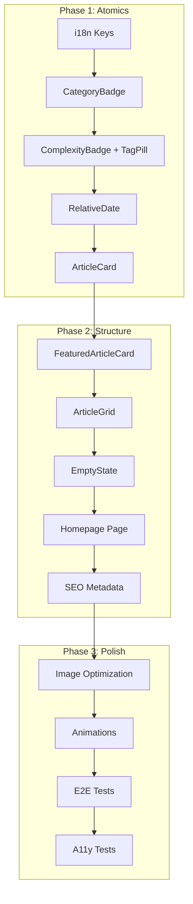

# Story 3.5: Homepage Implementation - Phases Plan

**Epic**: 3 - Frontend Core & Design System
**Story**: 3.5 - Homepage Implementation
**Status**: PLANNING
**Created**: 2025-12-05

---

## Story Overview

Implementer la page d'accueil de sebc.dev avec l'article vedette, la grille d'articles recents, l'etat vide et le CTA vers le Hub de Recherche.

---

## Phases Summary

| Phase | Name | Commits | Status | Description |
|-------|------|---------|--------|-------------|
| 1 | Composants Atomiques | 5 | NOT STARTED | CategoryBadge, ComplexityBadge, TagPill, RelativeDate, ArticleCard |
| 2 | Homepage Structure | 5 | NOT STARTED | FeaturedArticleCard, ArticleGrid, EmptyState, Homepage Page, SEO |
| 3 | Polish & Tests | 4 | NOT STARTED | Image optimization, Animations, E2E Tests, A11y Tests |

**Total Commits**: 14
**Estimated Implementation**: 7-10 hours

---

## Phase 1: Composants Atomiques

### Objective
Creer les composants atomiques reusables pour l'affichage des articles.

### Commits

| # | Description | Files | Lines |
|---|-------------|-------|-------|
| 1 | Add i18n keys for homepage and articles | 2 | ~60 |
| 2 | Create CategoryBadge component | 2 | ~80 |
| 3 | Create ComplexityBadge and TagPill | 3 | ~100 |
| 4 | Create RelativeDate client component | 2 | ~60 |
| 5 | Create ArticleCard component | 3 | ~150 |

### Components Created
- `CategoryBadge` - Badge categorie avec icone/couleur
- `ComplexityBadge` - Badge niveau (Debutant/Intermediaire/Avance)
- `TagPill` - Pill cliquable pour les tags
- `RelativeDate` - Date relative localisee (client component)
- `ArticleCard` - Carte article pour la grille

### Documentation
- [Phase 1 INDEX](./phase_1/INDEX.md)
- [Implementation Plan](./phase_1/IMPLEMENTATION_PLAN.md)
- [Commit Checklist](./phase_1/COMMIT_CHECKLIST.md)

---

## Phase 2: Homepage Structure

### Objective
Assembler les composants en une page Homepage fonctionnelle avec data fetching.

### Commits

| # | Description | Files | Lines |
|---|-------------|-------|-------|
| 1 | Create FeaturedArticleCard component | 2 | ~150 |
| 2 | Create ArticleGrid component | 2 | ~80 |
| 3 | Create EmptyState component | 2 | ~100 |
| 4 | Implement Homepage with Payload data | 1 | ~150 |
| 5 | Add SEO metadata for FR/EN | 1 | ~60 |

### Components Created
- `FeaturedArticleCard` - Carte article vedette pleine largeur
- `ArticleGrid` - Grille responsive d'articles
- `EmptyState` - Etat vide avec CTA conditionnel

### Key Features
- Data fetching via Payload Local API
- 7 articles max (1 featured + 6 grid)
- Empty state avec auth check
- SEO metadata bilingue

### Documentation
- [Phase 2 INDEX](./phase_2/INDEX.md)
- [Implementation Plan](./phase_2/IMPLEMENTATION_PLAN.md)
- [Commit Checklist](./phase_2/COMMIT_CHECKLIST.md)

---

## Phase 3: Polish & Tests

### Objective
Finaliser avec les optimisations et tests complets.

### Commits

| # | Description | Files | Lines |
|---|-------------|-------|-------|
| 1 | Configure Cloudflare image optimization | 3 | ~50 |
| 2 | Optimize hover animations (GPU) | 3 | ~80 |
| 3 | Add E2E tests for Homepage | 2 | ~200 |
| 4 | Add accessibility tests (axe-core) | 2 | ~100 |

### Deliverables
- Custom image loader pour Cloudflare R2
- Animations GPU-accelerated avec motion-safe
- 18 tests E2E couvrant tous les scenarios
- Tests accessibilite WCAG AA

### Documentation
- [Phase 3 INDEX](./phase_3/INDEX.md)
- [Implementation Plan](./phase_3/IMPLEMENTATION_PLAN.md)
- [Commit Checklist](./phase_3/COMMIT_CHECKLIST.md)

---

## Dependencies

### Story Dependencies

```
Story 3.1 (i18n Routing) -----> Story 3.5
                                   ^
Story 3.2 (Design System) --------/
                                   ^
Story 3.3 (Layout Global) --------/
                                   ^
Epic 2 (CMS Collections) ---------/
```

### Phase Dependencies

```
Phase 1 (Atomics) --> Phase 2 (Structure) --> Phase 3 (Polish)
```

---

## Acceptance Criteria Mapping

| AC | Phase | Commit |
|----|-------|--------|
| AC1: Article Vedette | Phase 2 | Commit 1 |
| AC2: Grille d'Articles | Phase 2 | Commit 2 |
| AC3: Carte d'Article | Phase 1 | Commit 5 |
| AC4: CTA Hub | Phase 2 | Commit 4 |
| AC5: Empty State | Phase 2 | Commit 3 |
| AC6: Data Fetching | Phase 2 | Commit 4 |
| AC7: SEO Metadata | Phase 2 | Commit 5 |
| AC8: Accessibilite | Phase 3 | Commit 4 |

---

## Risk Mitigation

| Risk | Probability | Impact | Mitigation |
|------|-------------|--------|------------|
| Posts collection not ready | Medium | High | Explicit Epic 2 dependency |
| Image loading issues | Low | Medium | Custom loader with fallback |
| A11y violations | Medium | Medium | axe-core tests in CI |

---

## Implementation Order



---

## Quick Commands

```bash
# Start Phase 1
/generate-phase-doc Epic 3 Story 3.5 Phase 1

# Implement commits
/implement-phase Epic 3 Story 3.5 Phase 1

# After Phase 1 complete
/generate-phase-doc Epic 3 Story 3.5 Phase 2

# Continue...
```

---

## Documentation Structure

```
docs/specs/epics/epic_3/story_3_5/
├── story_3.5.md                    # Story specification
└── implementation/
    ├── PHASES_PLAN.md              # This file
    ├── phase_1/
    │   ├── INDEX.md
    │   ├── IMPLEMENTATION_PLAN.md
    │   ├── COMMIT_CHECKLIST.md
    │   ├── ENVIRONMENT_SETUP.md
    │   ├── guides/
    │   │   ├── REVIEW.md
    │   │   └── TESTING.md
    │   └── validation/
    │       └── VALIDATION_CHECKLIST.md
    ├── phase_2/
    │   └── (same structure)
    └── phase_3/
        └── (same structure)
```

**Total Documentation Files**: 22
**Total Documentation Lines**: ~3500
