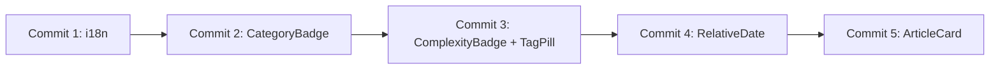

# Phase 1: Implementation Plan - Composants Atomiques

**Story**: 3.5 - Homepage Implementation
**Phase**: 1 of 3
**Total Commits**: 5

---

## Commit Strategy

Cette phase utilise une approche d'**atomic commits** pour garantir:
- Chaque commit est reviewable en 15-30 minutes
- Chaque commit est revertable sans casser le build
- Chaque commit represente une fonctionnalite complete

---

## Commits Overview

| # | Commit | Description | Files | Est. Lines |
|---|--------|-------------|-------|------------|
| 1 | i18n Keys | Ajouter les cles de traduction pour homepage et articles | 2 | ~60 |
| 2 | CategoryBadge | Badge categorie avec icone et couleur | 2 | ~80 |
| 3 | ComplexityBadge & TagPill | Badges de complexite et tags | 3 | ~100 |
| 4 | RelativeDate | Composant client pour dates relatives | 2 | ~60 |
| 5 | ArticleCard | Carte article composant principal | 3 | ~150 |

---

## Commit 1: i18n Keys

### Objective
Ajouter toutes les cles de traduction necessaires pour les composants articles et la homepage.

### Files Modified

| File | Action | Description |
|------|--------|-------------|
| `messages/fr.json` | MODIFY | Ajouter les cles FR |
| `messages/en.json` | MODIFY | Ajouter les cles EN |

### Changes Detail

**messages/fr.json** - Ajouter:
```json
{
  "homepage": {
    "recentArticles": "Articles recents",
    "viewAllArticles": "Voir tous les articles",
    "readArticle": "Lire l'article",
    "minRead": "{minutes} min de lecture",
    "emptyState": {
      "title": "Bienvenue sur sebc.dev !",
      "description": "Aucun article n'a encore ete publie.",
      "cta": "Creer un article"
    }
  },
  "article": {
    "publishedAgo": "Publie {time}",
    "complexity": {
      "beginner": "Debutant",
      "intermediate": "Intermediaire",
      "advanced": "Avance"
    }
  }
}
```

**messages/en.json** - Ajouter:
```json
{
  "homepage": {
    "recentArticles": "Recent articles",
    "viewAllArticles": "View all articles",
    "readArticle": "Read article",
    "minRead": "{minutes} min read",
    "emptyState": {
      "title": "Welcome to sebc.dev!",
      "description": "No articles have been published yet.",
      "cta": "Create an article"
    }
  },
  "article": {
    "publishedAgo": "Published {time}",
    "complexity": {
      "beginner": "Beginner",
      "intermediate": "Intermediate",
      "advanced": "Advanced"
    }
  }
}
```

### Validation
- [ ] `pnpm build` passe
- [ ] Les cles sont accessibles via `getTranslations('homepage')` et `getTranslations('article')`

### Commit Message
```
feat(i18n): add homepage and article translation keys

Add FR/EN translation keys for:
- Homepage section titles and CTAs
- Article complexity levels
- Reading time format
- Empty state messages
```

---

## Commit 2: CategoryBadge

### Objective
Creer le composant CategoryBadge qui affiche une categorie avec son icone et sa couleur.

### Files Created/Modified

| File | Action | Description |
|------|--------|-------------|
| `src/components/articles/CategoryBadge.tsx` | CREATE | Composant Badge categorie |
| `src/components/articles/index.ts` | CREATE | Barrel export |

### Implementation

**CategoryBadge.tsx**:
```typescript
import { Badge } from '@/components/ui/badge'
import Link from 'next/link'

interface Category {
  id: string
  title: string
  slug: string
  color?: string
  icon?: string
}

interface CategoryBadgeProps {
  category: Category
  locale: string
  clickable?: boolean
  className?: string
}

export function CategoryBadge({
  category,
  locale,
  clickable = true,
  className,
}: CategoryBadgeProps) {
  const style = category.color
    ? { backgroundColor: `${category.color}20`, color: category.color }
    : {}

  const content = (
    <Badge
      variant="secondary"
      className={cn('gap-1.5 transition-colors', className)}
      style={style}
    >
      {category.icon && <span>{category.icon}</span>}
      {category.title}
    </Badge>
  )

  if (!clickable) return content

  return (
    <Link
      href={`/${locale}/articles?category=${category.slug}`}
      className="hover:opacity-80"
    >
      {content}
    </Link>
  )
}
```

### Design Specs (from UX_UI_Spec.md)
- 5 categories canoniques avec icones:
  - Actualites: newspaper-icon, Bleu
  - Decryptage: microscope-icon, Indigo
  - Tutoriel: graduation-icon, Cyan
  - Etude de Cas: bar-chart-icon, Orange
  - Retour d'Experience: clipboard-icon, Amber

### Validation
- [ ] Badge affiche icone + titre
- [ ] Couleur dynamique basee sur `category.color`
- [ ] Click navigue vers Hub avec filtre `?category=X`
- [ ] `pnpm build` passe
- [ ] `pnpm lint` passe

### Commit Message
```
feat(components): add CategoryBadge component

Create CategoryBadge component that displays:
- Category icon and title
- Dynamic background color based on category
- Clickable link to Hub with category filter

Related: Story 3.5 Phase 1
```

---

## Commit 3: ComplexityBadge & TagPill

### Objective
Creer les composants ComplexityBadge et TagPill pour afficher le niveau de difficulte et les tags.

### Files Created/Modified

| File | Action | Description |
|------|--------|-------------|
| `src/components/articles/ComplexityBadge.tsx` | CREATE | Badge niveau complexite |
| `src/components/articles/TagPill.tsx` | CREATE | Pill pour tags cliquables |
| `src/components/articles/index.ts` | MODIFY | Ajouter exports |

### Implementation

**ComplexityBadge.tsx**:
```typescript
import { Badge } from '@/components/ui/badge'
import { useTranslations } from 'next-intl'

type Complexity = 'beginner' | 'intermediate' | 'advanced'

interface ComplexityBadgeProps {
  level: Complexity
  className?: string
}

const COMPLEXITY_CONFIG: Record<Complexity, { icon: string; classes: string }> = {
  beginner: {
    icon: 'book-open', // Lucide
    classes: 'bg-green-600/20 text-green-400 border-green-600/30',
  },
  intermediate: {
    icon: 'book-marked',
    classes: 'bg-orange-600/20 text-orange-400 border-orange-600/30',
  },
  advanced: {
    icon: 'book-lock',
    classes: 'bg-red-600/20 text-red-400 border-red-600/30',
  },
}

export function ComplexityBadge({ level, className }: ComplexityBadgeProps) {
  const t = useTranslations('article.complexity')
  const config = COMPLEXITY_CONFIG[level]

  return (
    <Badge
      variant="outline"
      className={cn(config.classes, className)}
    >
      <span className="mr-1">{getComplexityEmoji(level)}</span>
      {t(level)}
    </Badge>
  )
}

function getComplexityEmoji(level: Complexity): string {
  switch (level) {
    case 'beginner': return 'icon beginner'
    case 'intermediate': return 'icon intermediate'
    case 'advanced': return 'icon advanced'
  }
}
```

**TagPill.tsx**:
```typescript
import { Badge } from '@/components/ui/badge'
import Link from 'next/link'

interface Tag {
  id: string
  title: string
  slug: string
}

interface TagPillProps {
  tag: Tag
  locale: string
  className?: string
}

export function TagPill({ tag, locale, className }: TagPillProps) {
  return (
    <Link
      href={`/${locale}/articles?tags=${tag.slug}`}
      className="transition-opacity hover:opacity-80"
    >
      <Badge
        variant="outline"
        className={cn(
          'bg-muted/50 text-muted-foreground hover:bg-muted',
          className
        )}
      >
        {tag.title}
      </Badge>
    </Link>
  )
}
```

### Design Specs
- **Complexity Colors** (from UX_UI_Spec.md):
  - Debutant: Vert (#48BB78)
  - Intermediaire: Orange (#ED8936)
  - Avance: Rouge (#F56565)

### Validation
- [ ] ComplexityBadge affiche icone + label traduit
- [ ] Couleurs respectent la spec
- [ ] TagPill navigue vers Hub avec filtre `?tags=X`
- [ ] `pnpm build` passe
- [ ] `pnpm lint` passe

### Commit Message
```
feat(components): add ComplexityBadge and TagPill components

Create ComplexityBadge with:
- Color-coded levels (green/orange/red)
- Translated labels (FR/EN)
- Icon per complexity level

Create TagPill with:
- Clickable navigation to Hub with tag filter
- Subtle hover effect
```

---

## Commit 4: RelativeDate

### Objective
Creer un composant client pour afficher les dates relatives localisees ("Il y a 2 jours").

### Files Created/Modified

| File | Action | Description |
|------|--------|-------------|
| `src/components/RelativeDate.tsx` | CREATE | Client component pour dates relatives |
| `src/components/articles/index.ts` | MODIFY | Ajouter export |

### Implementation

**RelativeDate.tsx**:
```typescript
'use client'

import { useFormatter } from 'next-intl'

interface RelativeDateProps {
  date: string | Date
  className?: string
}

export function RelativeDate({ date, className }: RelativeDateProps) {
  const format = useFormatter()
  const dateObj = typeof date === 'string' ? new Date(date) : date

  // Utilise l'API Intl.RelativeTimeFormat via next-intl
  const relativeTime = format.relativeTime(dateObj)

  return (
    <time
      dateTime={dateObj.toISOString()}
      className={className}
      title={format.dateTime(dateObj, {
        dateStyle: 'long',
        timeStyle: 'short',
      })}
    >
      {relativeTime}
    </time>
  )
}
```

### Why Client Component?
- `useFormatter` de next-intl necessite un contexte client pour l'hydratation
- La date relative doit etre mise a jour cote client pour eviter les mismatches SSR/CSR
- Permet des updates futures (ex: mise a jour en temps reel)

### Validation
- [ ] Affiche "Il y a X jours/heures/minutes" en FR
- [ ] Affiche "X days/hours/minutes ago" en EN
- [ ] Attribut `datetime` ISO 8601 present
- [ ] Tooltip avec date complete au hover
- [ ] `pnpm build` passe

### Commit Message
```
feat(components): add RelativeDate client component

Create RelativeDate component that:
- Displays localized relative time (FR/EN)
- Uses next-intl formatter for consistency
- Shows full date on hover via title attribute
- Uses semantic <time> element with datetime
```

---

## Commit 5: ArticleCard

### Objective
Creer le composant ArticleCard qui combine tous les composants atomiques precedents.

### Files Created/Modified

| File | Action | Description |
|------|--------|-------------|
| `src/components/articles/ArticleCard.tsx` | CREATE | Carte article complete |
| `src/components/articles/index.ts` | MODIFY | Ajouter export |
| `src/components/ui/card.tsx` | CREATE (if needed) | Composant Card shadcn/ui |

### Implementation

**ArticleCard.tsx**:
```typescript
import Image from 'next/image'
import Link from 'next/link'
import { useTranslations } from 'next-intl'
import { Card, CardContent, CardHeader } from '@/components/ui/card'
import { CategoryBadge } from './CategoryBadge'
import { ComplexityBadge } from './ComplexityBadge'
import { TagPill } from './TagPill'
import { RelativeDate } from '../RelativeDate'

interface Article {
  id: string
  title: string
  slug: string
  excerpt: string
  coverImage?: { url: string; alt?: string } | null
  category: { id: string; title: string; slug: string; color?: string; icon?: string }
  tags: Array<{ id: string; title: string; slug: string }>
  complexity: 'beginner' | 'intermediate' | 'advanced'
  readingTime: number
  publishedAt: string
}

interface ArticleCardProps {
  article: Article
  locale: string
  className?: string
}

export function ArticleCard({ article, locale, className }: ArticleCardProps) {
  const t = useTranslations('homepage')

  return (
    <Link
      href={`/${locale}/articles/${article.slug}`}
      className="group block"
    >
      <Card className={cn(
        'h-full overflow-hidden transition-all duration-200',
        'hover:shadow-lg hover:scale-[1.02]',
        className
      )}>
        {/* Cover Image */}
        {article.coverImage && (
          <div className="relative aspect-video overflow-hidden">
            <Image
              src={article.coverImage.url}
              alt={article.coverImage.alt || article.title}
              fill
              className="object-cover transition-transform duration-200 group-hover:scale-105"
            />
          </div>
        )}

        <CardHeader className="space-y-2 pb-2">
          {/* Category Badge */}
          <CategoryBadge
            category={article.category}
            locale={locale}
            clickable={false}
          />

          {/* Title */}
          <h3 className="line-clamp-2 text-lg font-semibold leading-tight">
            {article.title}
          </h3>
        </CardHeader>

        <CardContent className="space-y-3">
          {/* Excerpt */}
          <p className="line-clamp-2 text-sm text-muted-foreground">
            {article.excerpt}
          </p>

          {/* Metadata Row */}
          <div className="flex items-center gap-2 text-xs text-muted-foreground">
            <span>{t('minRead', { minutes: article.readingTime })}</span>
            <span>-</span>
            <RelativeDate date={article.publishedAt} />
          </div>

          {/* Complexity Badge */}
          <ComplexityBadge level={article.complexity} />

          {/* Tags (max 3) */}
          {article.tags.length > 0 && (
            <div className="flex flex-wrap gap-1.5">
              {article.tags.slice(0, 3).map((tag) => (
                <TagPill
                  key={tag.id}
                  tag={tag}
                  locale={locale}
                />
              ))}
            </div>
          )}
        </CardContent>
      </Card>
    </Link>
  )
}
```

### Design Specs (from UX_UI_Spec.md 8.6.7)
- **Hover carte**: Legere elevation (shadow), scale 1.02, transition 200ms
- **Hover image**: Zoom subtil (scale 1.05) avec overflow hidden
- **Click carte**: Navigation vers `/[locale]/articles/[slug]`

### Validation
- [ ] Carte affiche tous les elements (image, titre, extrait, metadata)
- [ ] Hover effects fonctionnent
- [ ] Navigation vers article fonctionne
- [ ] Tags limitees a 3 maximum
- [ ] Line-clamp fonctionne sur titre et extrait
- [ ] `pnpm build` passe
- [ ] `pnpm lint` passe

### Commit Message
```
feat(components): add ArticleCard component

Create ArticleCard that composes:
- Cover image with hover zoom effect
- CategoryBadge (non-clickable in card context)
- Title with line-clamp
- Excerpt with line-clamp
- Reading time and relative date
- ComplexityBadge
- TagPills (max 3)

Implements hover effects per UX_UI_Spec.md:
- Card scale 1.02 + shadow on hover
- Image scale 1.05 on hover
```

---

## Implementation Order



**Rationale**:
1. i18n keys first - prerequis pour tous les composants traduits
2. CategoryBadge - composant independant, utilise dans ArticleCard
3. ComplexityBadge + TagPill - composants independants, utilises dans ArticleCard
4. RelativeDate - composant client necessaire pour ArticleCard
5. ArticleCard - compose tous les composants precedents

---

## Total Phase Metrics

| Metric | Value |
|--------|-------|
| **Total Files Created** | 6 |
| **Total Files Modified** | 3 |
| **Total Lines** | ~400-500 |
| **Total Commits** | 5 |
| **Estimated Time** | 2-3 hours |
