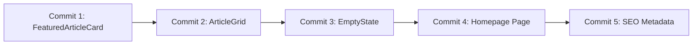

# Phase 2: Implementation Plan - Homepage Structure

**Story**: 3.5 - Homepage Implementation
**Phase**: 2 of 3
**Total Commits**: 5

---

## Commit Strategy

Cette phase construit la structure principale de la Homepage en utilisant les composants atomiques de la Phase 1.

---

## Commits Overview

| # | Commit | Description | Files | Est. Lines |
|---|--------|-------------|-------|------------|
| 1 | FeaturedArticleCard | Carte article vedette pleine largeur | 2 | ~150 |
| 2 | ArticleGrid | Grille responsive d'articles | 2 | ~80 |
| 3 | EmptyState | Composant etat vide avec CTA | 2 | ~100 |
| 4 | Homepage Page | Page avec data fetching | 1 | ~150 |
| 5 | SEO Metadata | generateMetadata pour FR/EN | 1 | ~60 |

---

## Commit 1: FeaturedArticleCard

### Objective
Creer la carte d'article vedette qui s'affiche en pleine largeur en tete de la homepage.

### Files Created/Modified

| File | Action | Description |
|------|--------|-------------|
| `src/components/articles/FeaturedArticleCard.tsx` | CREATE | Carte article vedette |
| `src/components/articles/index.ts` | MODIFY | Ajouter export |

### Implementation

**FeaturedArticleCard.tsx**:
```typescript
import Image from 'next/image'
import Link from 'next/link'
import { getTranslations } from 'next-intl/server'
import { ArrowRight } from 'lucide-react'
import { Card, CardContent, CardHeader } from '@/components/ui/card'
import { Button } from '@/components/ui/button'
import { cn } from '@/lib/utils'
import { CategoryBadge } from './CategoryBadge'
import { ComplexityBadge } from './ComplexityBadge'
import { TagPill } from './TagPill'
import { RelativeDate } from '../RelativeDate'

interface Article {
  id: string
  title: string
  slug: string
  excerpt: string
  coverImage?: { url: string; alt?: string } | null
  category: {
    id: string
    title: string
    slug: string
    color?: string
    icon?: string
  }
  tags: Array<{ id: string; title: string; slug: string }>
  complexity: 'beginner' | 'intermediate' | 'advanced'
  readingTime: number
  publishedAt: string
}

interface FeaturedArticleCardProps {
  article: Article
  locale: string
  className?: string
}

export async function FeaturedArticleCard({
  article,
  locale,
  className,
}: FeaturedArticleCardProps) {
  const t = await getTranslations('homepage')

  return (
    <article className={cn('group', className)}>
      <Card className={cn(
        'overflow-hidden transition-all duration-300',
        'hover:shadow-xl hover:scale-[1.01]'
      )}>
        {/* Cover Image - Full Width */}
        {article.coverImage && (
          <div className="relative aspect-video max-h-[400px] overflow-hidden">
            <Image
              src={article.coverImage.url}
              alt={article.coverImage.alt || article.title}
              fill
              priority
              sizes="100vw"
              className="object-cover transition-transform duration-300 group-hover:scale-105"
            />
          </div>
        )}

        <CardHeader className="space-y-4 pb-4">
          {/* Metadata Row */}
          <div className="flex flex-wrap items-center gap-3 text-sm">
            <CategoryBadge
              category={article.category}
              locale={locale}
            />
            <span className="text-muted-foreground">-</span>
            <span className="text-muted-foreground">
              {t('minRead', { minutes: article.readingTime })}
            </span>
            <span className="text-muted-foreground">-</span>
            <RelativeDate
              date={article.publishedAt}
              className="text-muted-foreground"
            />
            <span className="text-muted-foreground">-</span>
            <ComplexityBadge level={article.complexity} />
          </div>

          {/* Title - H1 for featured article */}
          <h1 className="text-2xl font-bold leading-tight sm:text-3xl lg:text-4xl">
            <Link
              href={`/${locale}/articles/${article.slug}`}
              className="hover:text-primary transition-colors"
            >
              {article.title}
            </Link>
          </h1>
        </CardHeader>

        <CardContent className="space-y-4">
          {/* Excerpt */}
          <p className="text-base text-muted-foreground line-clamp-3 sm:text-lg">
            {article.excerpt}
          </p>

          {/* Tags */}
          {article.tags.length > 0 && (
            <div className="flex flex-wrap gap-2">
              {article.tags.slice(0, 5).map((tag) => (
                <TagPill key={tag.id} tag={tag} locale={locale} />
              ))}
            </div>
          )}

          {/* CTA Button */}
          <div className="flex justify-end pt-2">
            <Button asChild>
              <Link href={`/${locale}/articles/${article.slug}`}>
                {t('readArticle')}
                <ArrowRight className="ml-2 h-4 w-4" />
              </Link>
            </Button>
          </div>
        </CardContent>
      </Card>
    </article>
  )
}
```

### Design Specs (from UX_UI_Spec.md 8.6.2)

| Element | Desktop | Tablet | Mobile |
|---------|---------|--------|--------|
| Image | 100% width, 16:9, max-h 400px | 100% width | 100% width |
| Title | H1, 2.25rem (36px) | 1.875rem (30px) | 1.5rem (24px) |
| Excerpt | Max 3 lines | Max 3 lines | Max 2 lines |
| CTA | Aligned right | Full width | Full width |

### Validation
- [ ] Image avec `priority` pour LCP
- [ ] Title est un `<h1>` (unique sur la page)
- [ ] Hover effects sur carte et image
- [ ] Tags limites a 5 pour le featured
- [ ] `pnpm build` passe

### Commit Message
```
feat(components): add FeaturedArticleCard component

Create featured article card for homepage hero:
- Full-width cover image with zoom effect
- H1 title for SEO
- Category, complexity, reading time metadata
- Up to 5 tags displayed
- CTA button to article page

Related: Story 3.5 Phase 2
```

---

## Commit 2: ArticleGrid

### Objective
Creer le conteneur de grille responsive pour les articles recents.

### Files Created/Modified

| File | Action | Description |
|------|--------|-------------|
| `src/components/articles/ArticleGrid.tsx` | CREATE | Grille responsive |
| `src/components/articles/index.ts` | MODIFY | Ajouter export |

### Implementation

**ArticleGrid.tsx**:
```typescript
import { getTranslations } from 'next-intl/server'
import { cn } from '@/lib/utils'
import { ArticleCard } from './ArticleCard'

interface Article {
  id: string
  title: string
  slug: string
  excerpt: string
  coverImage?: { url: string; alt?: string } | null
  category: {
    id: string
    title: string
    slug: string
    color?: string
    icon?: string
  }
  tags: Array<{ id: string; title: string; slug: string }>
  complexity: 'beginner' | 'intermediate' | 'advanced'
  readingTime: number
  publishedAt: string
}

interface ArticleGridProps {
  articles: Article[]
  locale: string
  title?: string
  className?: string
}

export async function ArticleGrid({
  articles,
  locale,
  title,
  className,
}: ArticleGridProps) {
  const t = await getTranslations('homepage')
  const sectionTitle = title ?? t('recentArticles')

  if (articles.length === 0) {
    return null
  }

  return (
    <section className={cn('space-y-6', className)}>
      {/* Section Title */}
      <h2 className="text-2xl font-bold">{sectionTitle}</h2>

      {/* Grid */}
      <div className={cn(
        'grid gap-4',
        'sm:gap-5',
        'lg:gap-6',
        'grid-cols-1',
        'md:grid-cols-2',
        'lg:grid-cols-3'
      )}>
        {articles.map((article) => (
          <ArticleCard
            key={article.id}
            article={article}
            locale={locale}
          />
        ))}
      </div>
    </section>
  )
}
```

### Responsive Grid Specs

| Breakpoint | Columns | Gap |
|------------|---------|-----|
| Mobile (<768px) | 1 | 16px (gap-4) |
| Tablet (768-1023px) | 2 | 20px (gap-5) |
| Desktop (>=1024px) | 3 | 24px (gap-6) |

### Validation
- [ ] Grille responsive fonctionne
- [ ] Section title traduite
- [ ] Return null si pas d'articles
- [ ] `pnpm build` passe

### Commit Message
```
feat(components): add ArticleGrid component

Create responsive grid for recent articles:
- 1 column on mobile
- 2 columns on tablet
- 3 columns on desktop
- Responsive gaps (16/20/24px)
- Section title with i18n support

Related: Story 3.5 Phase 2
```

---

## Commit 3: EmptyState

### Objective
Creer le composant d'etat vide qui s'affiche quand aucun article n'est publie.

### Files Created/Modified

| File | Action | Description |
|------|--------|-------------|
| `src/components/EmptyState.tsx` | CREATE | Composant etat vide |
| `src/components/articles/index.ts` | MODIFY | Ajouter export |

### Implementation

**EmptyState.tsx**:
```typescript
import Link from 'next/link'
import { getTranslations } from 'next-intl/server'
import { cookies } from 'next/headers'
import { FileText, PenLine } from 'lucide-react'
import { Button } from '@/components/ui/button'
import { cn } from '@/lib/utils'

interface EmptyStateProps {
  locale: string
  className?: string
}

export async function EmptyState({ locale, className }: EmptyStateProps) {
  const t = await getTranslations('homepage.emptyState')

  // Check if user is authenticated via payload-token cookie
  const cookieStore = await cookies()
  const isAuthenticated = cookieStore.has('payload-token')

  return (
    <section
      className={cn(
        'flex flex-col items-center justify-center py-16 text-center',
        className
      )}
    >
      {/* Icon */}
      <div className="mb-6 rounded-full bg-muted p-6">
        <FileText className="h-12 w-12 text-muted-foreground" />
      </div>

      {/* Title */}
      <h1 className="mb-2 text-2xl font-bold">{t('title')}</h1>

      {/* Description */}
      <p className="mb-8 max-w-md text-muted-foreground">
        {t('description')}
      </p>

      {/* CTA - Only visible if authenticated */}
      {isAuthenticated && (
        <Button asChild>
          <Link href="/admin/collections/posts/create">
            <PenLine className="mr-2 h-4 w-4" />
            {t('cta')}
          </Link>
        </Button>
      )}
    </section>
  )
}
```

### Design Specs (from UX_UI_Spec.md 8.6.4)

```
+-----------------------------------------------------------+
|                                                            |
|                         [icon]                              |
|                                                            |
|              Bienvenue sur sebc.dev !                      |
|                                                            |
|       Aucun article n'a encore ete publie.                |
|                                                            |
|              [Creer un article ->]                         |
|              (visible si authentifie)                      |
|                                                            |
+-----------------------------------------------------------+
```

### Validation
- [ ] Message d'accueil affiche
- [ ] CTA visible UNIQUEMENT si cookie `payload-token` present
- [ ] CTA redirige vers `/admin/collections/posts/create`
- [ ] `pnpm build` passe

### Commit Message
```
feat(components): add EmptyState component

Create empty state for homepage when no articles:
- Welcome message with icon
- Description text
- Conditional CTA (only if authenticated)
- Reads payload-token cookie for auth check

Related: Story 3.5 Phase 2
```

---

## Commit 4: Homepage Page

### Objective
Implementer la page Homepage complete avec data fetching Payload.

### Files Modified

| File | Action | Description |
|------|--------|-------------|
| `src/app/[locale]/(frontend)/page.tsx` | REPLACE | Homepage complete |

### Implementation

**page.tsx**:
```typescript
import { headers } from 'next/headers'
import Link from 'next/link'
import { getPayload } from 'payload'
import { getTranslations, setRequestLocale } from 'next-intl/server'
import { ArrowRight } from 'lucide-react'
import config from '@payload-config'
import { Button } from '@/components/ui/button'
import { FeaturedArticleCard } from '@/components/articles/FeaturedArticleCard'
import { ArticleGrid } from '@/components/articles/ArticleGrid'
import { EmptyState } from '@/components/EmptyState'

interface HomePageProps {
  params: Promise<{ locale: string }>
}

export default async function HomePage({ params }: HomePageProps) {
  const { locale } = await params
  setRequestLocale(locale)

  const t = await getTranslations('homepage')
  const payloadConfig = await config
  const payload = await getPayload({ config: payloadConfig })

  // Fetch 7 most recent published articles
  const { docs: articles } = await payload.find({
    collection: 'posts',
    locale,
    limit: 7,
    sort: '-publishedAt',
    where: {
      _status: { equals: 'published' },
    },
    depth: 2,
  })

  // Empty state if no articles
  if (articles.length === 0) {
    return (
      <main className="container mx-auto px-4 py-12">
        <EmptyState locale={locale} />
      </main>
    )
  }

  // Destructure: first article is featured, rest are grid
  const [featuredArticle, ...recentArticles] = articles

  return (
    <main className="container mx-auto px-4 py-8 space-y-12">
      {/* Featured Article (Hero) */}
      <FeaturedArticleCard
        article={featuredArticle}
        locale={locale}
      />

      {/* Recent Articles Grid */}
      {recentArticles.length > 0 && (
        <ArticleGrid
          articles={recentArticles}
          locale={locale}
        />
      )}

      {/* CTA to Hub */}
      <section className="flex justify-center py-8">
        <Button asChild size="lg" variant="outline">
          <Link href={`/${locale}/articles`}>
            {t('viewAllArticles')}
            <ArrowRight className="ml-2 h-4 w-4" />
          </Link>
        </Button>
      </section>
    </main>
  )
}
```

### Data Fetching Notes
- `depth: 2` pour inclure les relations (category, tags)
- `sort: '-publishedAt'` pour les plus recents en premier
- `where: { _status: { equals: 'published' } }` pour filtrer les drafts

### Validation
- [ ] Data fetching fonctionne
- [ ] Featured article + grille affiches correctement
- [ ] Empty state affiche si 0 articles
- [ ] CTA vers Hub visible
- [ ] `pnpm build` passe
- [ ] `pnpm dev` fonctionne

### Commit Message
```
feat(homepage): implement homepage with Payload data

Replace placeholder homepage with full implementation:
- Fetch 7 most recent published articles
- Display featured article card (first article)
- Display article grid (remaining 6 articles)
- Show empty state when no articles
- Add CTA to Hub de Recherche

Related: Story 3.5 Phase 2
```

---

## Commit 5: SEO Metadata

### Objective
Ajouter les metadata SEO pour la homepage avec support FR/EN.

### Files Modified

| File | Action | Description |
|------|--------|-------------|
| `src/app/[locale]/(frontend)/page.tsx` | MODIFY | Ajouter generateMetadata |

### Implementation

Ajouter au debut du fichier `page.tsx`:

```typescript
import type { Metadata } from 'next'

interface HomePageProps {
  params: Promise<{ locale: string }>
}

export async function generateMetadata({
  params,
}: HomePageProps): Promise<Metadata> {
  const { locale } = await params

  const titles = {
    fr: 'Accueil | sebc.dev',
    en: 'Home | sebc.dev',
  }

  const descriptions = {
    fr: "Blog technique sur l'IA, l'UX et l'ingenierie logicielle",
    en: 'Technical blog about AI, UX and software engineering',
  }

  return {
    title: titles[locale as keyof typeof titles] || titles.fr,
    description: descriptions[locale as keyof typeof descriptions] || descriptions.fr,
    alternates: {
      canonical: `https://sebc.dev/${locale}`,
      languages: {
        fr: '/fr',
        en: '/en',
      },
    },
    openGraph: {
      title: titles[locale as keyof typeof titles] || titles.fr,
      description: descriptions[locale as keyof typeof descriptions] || descriptions.fr,
      url: `https://sebc.dev/${locale}`,
      siteName: 'sebc.dev',
      locale: locale === 'en' ? 'en_US' : 'fr_FR',
      type: 'website',
    },
    twitter: {
      card: 'summary_large_image',
      title: titles[locale as keyof typeof titles] || titles.fr,
      description: descriptions[locale as keyof typeof descriptions] || descriptions.fr,
    },
  }
}
```

### SEO Specs (from Architecture_technique.md)
- Title: "Accueil | sebc.dev" (FR) / "Home | sebc.dev" (EN)
- Description localisee
- hreflang pour FR et EN
- Canonical URL correcte

### Validation
- [ ] Title correct en FR et EN
- [ ] Description correcte en FR et EN
- [ ] Balises hreflang presentes
- [ ] Canonical URL correcte
- [ ] OpenGraph metadata presente
- [ ] `pnpm build` passe

### Commit Message
```
feat(seo): add homepage metadata for FR/EN

Add generateMetadata function with:
- Localized titles and descriptions
- hreflang alternates for FR/EN
- Canonical URLs
- OpenGraph metadata
- Twitter card metadata

Related: Story 3.5 Phase 2
```

---

## Implementation Order



**Rationale**:
1. FeaturedArticleCard - Composant independant pour l'article vedette
2. ArticleGrid - Utilise ArticleCard de Phase 1
3. EmptyState - Composant independant pour l'etat vide
4. Homepage Page - Assemble tous les composants
5. SEO Metadata - Finalise avec metadata

---

## Total Phase Metrics

| Metric | Value |
|--------|-------|
| **Total Files Created** | 3 |
| **Total Files Modified** | 2 |
| **Total Lines** | ~500-600 |
| **Total Commits** | 5 |
| **Estimated Time** | 3-4 hours |
