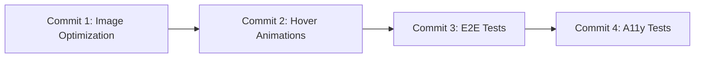

# Phase 3: Implementation Plan - Polish & Tests

**Story**: 3.5 - Homepage Implementation
**Phase**: 3 of 3
**Total Commits**: 4

---

## Commit Strategy

Cette phase finalise l'implementation avec les optimisations et tests.

---

## Commits Overview

| # | Commit | Description | Files | Est. Lines |
|---|--------|-------------|-------|------------|
| 1 | Image Optimization | Configurer Cloudflare image loader | 3 | ~50 |
| 2 | Hover Animations | Optimiser les animations CSS | 3 | ~80 |
| 3 | E2E Tests | Tests Playwright complets | 2 | ~200 |
| 4 | Accessibility Tests | Tests axe-core | 2 | ~100 |

---

## Commit 1: Image Optimization

### Objective
Configurer next/image pour utiliser le loader Cloudflare R2 et optimiser les images.

### Files Modified

| File | Action | Description |
|------|--------|-------------|
| `next.config.ts` | MODIFY | Ajouter image config |
| `src/lib/image-loader.ts` | CREATE | Custom loader Cloudflare |
| `src/components/articles/FeaturedArticleCard.tsx` | MODIFY | Ajouter loader |

### Implementation

**src/lib/image-loader.ts**:
```typescript
import type { ImageLoaderProps } from 'next/image'

export function cloudflareImageLoader({ src, width, quality }: ImageLoaderProps): string {
  // If it's an external URL, return as is
  if (src.startsWith('http://') || src.startsWith('https://')) {
    // For Cloudflare R2 URLs, we can add image resizing params
    const url = new URL(src)

    // Add Cloudflare image resizing params if it's an R2 URL
    if (url.hostname.includes('r2.cloudflarestorage.com') ||
        url.hostname.includes('r2.dev')) {
      url.searchParams.set('width', width.toString())
      if (quality) {
        url.searchParams.set('quality', quality.toString())
      }
      return url.toString()
    }

    return src
  }

  // For local/relative URLs, return with width param
  return `${src}?w=${width}&q=${quality || 75}`
}
```

**next.config.ts** - Ajouter:
```typescript
const nextConfig: NextConfig = {
  // ... existing config
  images: {
    loader: 'custom',
    loaderFile: './src/lib/image-loader.ts',
    remotePatterns: [
      {
        protocol: 'https',
        hostname: '*.r2.cloudflarestorage.com',
      },
      {
        protocol: 'https',
        hostname: '*.r2.dev',
      },
      // Add your R2 custom domain if you have one
    ],
  },
}
```

### Validation
- [ ] Images chargent correctement
- [ ] Pas d'erreur console
- [ ] `pnpm build` passe

### Commit Message
```
feat(images): configure Cloudflare image optimization

Add custom image loader for Cloudflare R2:
- Custom loader function for width/quality params
- Remote patterns for R2 domains
- Fallback for non-R2 images

Related: Story 3.5 Phase 3
```

---

## Commit 2: Hover Animations

### Objective
Optimiser les animations hover pour etre fluides (GPU-accelerated) et respecter prefers-reduced-motion.

### Files Modified

| File | Action | Description |
|------|--------|-------------|
| `src/components/articles/ArticleCard.tsx` | MODIFY | Optimiser animations |
| `src/components/articles/FeaturedArticleCard.tsx` | MODIFY | Optimiser animations |
| `src/app/globals.css` | MODIFY | Ajouter utilities CSS |

### Implementation

**globals.css** - Ajouter:
```css
/* GPU-accelerated animations */
@layer utilities {
  .gpu-accelerated {
    transform: translateZ(0);
    will-change: transform;
  }

  /* Reduce motion for accessibility */
  @media (prefers-reduced-motion: reduce) {
    .motion-safe\:animate-hover {
      transition: none !important;
      transform: none !important;
    }
  }
}
```

**ArticleCard.tsx** - Mettre a jour les classes:
```typescript
<Card className={cn(
  'h-full overflow-hidden',
  // GPU-accelerated transforms
  'transform-gpu transition-all duration-200 ease-out',
  // Motion-safe hover effects
  'motion-safe:hover:shadow-lg motion-safe:hover:scale-[1.02]',
  // Focus ring for accessibility
  'focus-within:ring-2 focus-within:ring-primary focus-within:ring-offset-2',
  className
)}>
```

**FeaturedArticleCard.tsx** - Mettre a jour:
```typescript
<Card className={cn(
  'overflow-hidden',
  // GPU-accelerated transforms
  'transform-gpu transition-all duration-300 ease-out',
  // Motion-safe hover effects
  'motion-safe:hover:shadow-xl motion-safe:hover:scale-[1.01]',
  className
)}>
```

### Validation
- [ ] Animations fluides (60fps)
- [ ] Animations desactivees avec prefers-reduced-motion
- [ ] `pnpm build` passe

### Commit Message
```
perf(animations): optimize hover effects for GPU acceleration

Improve hover animations:
- Add transform-gpu for GPU acceleration
- Use motion-safe: for reduced-motion support
- Optimize transition timing (200ms/300ms)
- Add will-change for performance

Related: Story 3.5 Phase 3
```

---

## Commit 3: E2E Tests

### Objective
Implementer les tests E2E Playwright pour la Homepage.

### Files Created

| File | Action | Description |
|------|--------|-------------|
| `tests/e2e/homepage.e2e.spec.ts` | CREATE | Tests E2E Homepage |
| `tests/e2e/fixtures/test-data.ts` | CREATE | Donnees de test |

### Implementation

**tests/e2e/homepage.e2e.spec.ts**:
```typescript
import { test, expect } from '@playwright/test'

test.describe('Homepage', () => {
  test.describe('With Articles', () => {
    test.beforeEach(async ({ page }) => {
      // Navigate to FR homepage
      await page.goto('/fr')
    })

    test('displays page correctly', async ({ page }) => {
      // Page title
      await expect(page).toHaveTitle(/Accueil.*sebc\.dev/)

      // Main content visible
      await expect(page.locator('main')).toBeVisible()
    })

    test('displays featured article when articles exist', async ({ page }) => {
      // Featured article H1 visible
      const h1 = page.locator('h1')
      await expect(h1).toBeVisible()

      // Featured article has read button
      await expect(page.getByRole('link', { name: /Lire l'article/i })).toBeVisible()
    })

    test('displays article grid', async ({ page }) => {
      // Section title visible
      const sectionTitle = page.getByRole('heading', { name: /Articles récents/i })
      await expect(sectionTitle).toBeVisible()

      // Grid has articles
      const articleCards = page.locator('[data-testid="article-card"]')
      // At least some articles in grid (if data exists)
      const count = await articleCards.count()
      expect(count).toBeGreaterThanOrEqual(0)
    })

    test('displays CTA to Hub', async ({ page }) => {
      const ctaButton = page.getByRole('link', { name: /Voir tous les articles/i })
      await expect(ctaButton).toBeVisible()
    })

    test('navigates to article on card click', async ({ page }) => {
      // Click on featured article title
      const articleLink = page.locator('h1 a').first()

      if (await articleLink.isVisible()) {
        await articleLink.click()
        await expect(page).toHaveURL(/\/fr\/articles\//)
      }
    })

    test('navigates to Hub on CTA click', async ({ page }) => {
      const ctaButton = page.getByRole('link', { name: /Voir tous les articles/i })

      if (await ctaButton.isVisible()) {
        await ctaButton.click()
        await expect(page).toHaveURL('/fr/articles')
      }
    })
  })

  test.describe('Empty State', () => {
    // Note: These tests require a clean database state
    // or test fixtures that return no articles

    test('displays empty state message', async ({ page }) => {
      // This test assumes no published articles
      await page.goto('/fr')

      // Check for empty state (may or may not be visible depending on data)
      const emptyTitle = page.getByRole('heading', { name: /Bienvenue sur sebc\.dev/i })

      // If empty state is visible, verify content
      if (await emptyTitle.isVisible()) {
        await expect(emptyTitle).toBeVisible()
        await expect(page.getByText(/Aucun article/i)).toBeVisible()
      }
    })

    test('hides create CTA when not authenticated', async ({ page }) => {
      await page.goto('/fr')

      // If empty state is visible
      const emptyTitle = page.getByRole('heading', { name: /Bienvenue sur sebc\.dev/i })

      if (await emptyTitle.isVisible()) {
        // Create CTA should not be visible
        await expect(page.getByRole('link', { name: /Créer un article/i })).not.toBeVisible()
      }
    })
  })

  test.describe('Responsive', () => {
    test('displays correctly on mobile', async ({ page }) => {
      await page.setViewportSize({ width: 375, height: 667 })
      await page.goto('/fr')

      // Page loads
      await expect(page.locator('main')).toBeVisible()
    })

    test('displays correctly on tablet', async ({ page }) => {
      await page.setViewportSize({ width: 768, height: 1024 })
      await page.goto('/fr')

      await expect(page.locator('main')).toBeVisible()
    })

    test('displays correctly on desktop', async ({ page }) => {
      await page.setViewportSize({ width: 1280, height: 800 })
      await page.goto('/fr')

      await expect(page.locator('main')).toBeVisible()
    })
  })

  test.describe('Multilingual', () => {
    test('displays French content on /fr', async ({ page }) => {
      await page.goto('/fr')
      await expect(page).toHaveTitle(/Accueil/)
    })

    test('displays English content on /en', async ({ page }) => {
      await page.goto('/en')
      await expect(page).toHaveTitle(/Home/)
    })
  })
})
```

### Validation
- [ ] Tous les tests passent
- [ ] Tests couvrent les scenarios principaux
- [ ] `pnpm test:e2e` passe

### Commit Message
```
test(e2e): add comprehensive homepage tests

Add Playwright E2E tests for homepage:
- Featured article display
- Article grid rendering
- Empty state handling
- Navigation to articles
- Navigation to Hub
- Responsive layouts
- Multilingual support (FR/EN)

Related: Story 3.5 Phase 3
```

---

## Commit 4: Accessibility Tests

### Objective
Ajouter les tests d'accessibilite avec axe-playwright.

### Files Modified

| File | Action | Description |
|------|--------|-------------|
| `tests/e2e/homepage.e2e.spec.ts` | MODIFY | Ajouter tests a11y |
| `package.json` | MODIFY | Ajouter @axe-core/playwright |

### Implementation

**Installation**:
```bash
pnpm add -D @axe-core/playwright
```

**tests/e2e/homepage.e2e.spec.ts** - Ajouter:
```typescript
import AxeBuilder from '@axe-core/playwright'

test.describe('Accessibility', () => {
  test('homepage passes axe audit (FR)', async ({ page }) => {
    await page.goto('/fr')

    const results = await new AxeBuilder({ page })
      .withTags(['wcag2a', 'wcag2aa', 'wcag21aa'])
      .analyze()

    // No critical or serious violations
    const criticalViolations = results.violations.filter(
      (v) => v.impact === 'critical' || v.impact === 'serious'
    )

    expect(criticalViolations).toHaveLength(0)
  })

  test('homepage passes axe audit (EN)', async ({ page }) => {
    await page.goto('/en')

    const results = await new AxeBuilder({ page })
      .withTags(['wcag2a', 'wcag2aa', 'wcag21aa'])
      .analyze()

    const criticalViolations = results.violations.filter(
      (v) => v.impact === 'critical' || v.impact === 'serious'
    )

    expect(criticalViolations).toHaveLength(0)
  })

  test('has correct heading hierarchy', async ({ page }) => {
    await page.goto('/fr')

    // Get all headings
    const headings = await page.locator('h1, h2, h3, h4, h5, h6').allTextContents()

    // Should have at least one heading
    expect(headings.length).toBeGreaterThan(0)

    // H1 count should be exactly 1
    const h1Count = await page.locator('h1').count()
    expect(h1Count).toBe(1)
  })

  test('all images have alt text', async ({ page }) => {
    await page.goto('/fr')

    const images = page.locator('img')
    const count = await images.count()

    for (let i = 0; i < count; i++) {
      const img = images.nth(i)
      const alt = await img.getAttribute('alt')
      expect(alt).not.toBeNull()
      expect(alt).not.toBe('')
    }
  })

  test('all interactive elements are focusable', async ({ page }) => {
    await page.goto('/fr')

    // Tab through the page
    await page.keyboard.press('Tab')

    // Check that something received focus
    const focusedElement = page.locator(':focus')
    await expect(focusedElement).toBeVisible()
  })

  test('focus indicators are visible', async ({ page }) => {
    await page.goto('/fr')

    // Focus on first link
    await page.keyboard.press('Tab')

    // Get the focused element
    const focused = page.locator(':focus')

    // Check that it has visible focus (outline or ring)
    const outlineStyle = await focused.evaluate((el) => {
      const styles = window.getComputedStyle(el)
      return {
        outline: styles.outline,
        boxShadow: styles.boxShadow,
      }
    })

    // Should have some focus indicator
    const hasFocusIndicator =
      outlineStyle.outline !== 'none' ||
      outlineStyle.boxShadow !== 'none'

    expect(hasFocusIndicator).toBe(true)
  })
})
```

### Validation
- [ ] `pnpm add -D @axe-core/playwright` execute
- [ ] Tous les tests a11y passent
- [ ] Pas de violations critiques/serieuses
- [ ] `pnpm test:e2e` passe

### Commit Message
```
test(a11y): add accessibility tests for homepage

Add axe-core accessibility tests:
- WCAG 2.1 AA compliance check
- Heading hierarchy validation
- Alt text verification
- Focus management testing
- Focus indicator visibility

Related: Story 3.5 Phase 3
```

---

## Implementation Order



---

## Total Phase Metrics

| Metric | Value |
|--------|-------|
| **Total Files Created** | 3 |
| **Total Files Modified** | 5 |
| **Total Lines** | ~400-450 |
| **Total Commits** | 4 |
| **Estimated Time** | 2-3 hours |
