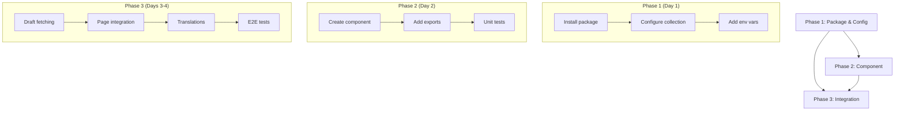

# PHASES_PLAN.md - Story 4.3: Live Preview

**Story**: Story 4.3 - Live Preview
**Epic**: Epic 4 - Article Reading Experience
**Created**: 2025-12-11
**Status**: PLANNING

---

## Story Overview

### User Story

> **En tant qu'** Auteur, **je veux** utiliser le mode "Live Preview" de Payload pour voir mes modifications en temps reel sur le frontend Next.js (ecran scinde), **afin d'** ajuster la mise en page avant publication.

### Story Objectives

1. Enable real-time preview of article changes in Payload Admin
2. Display split view with form editor and Next.js frontend preview
3. Support bilingual preview URLs (FR/EN)
4. Integrate seamlessly with existing article page architecture

### Success Metrics

- Live Preview loads article in iframe within 2 seconds
- Field changes trigger preview update within 500ms
- No visual regressions in normal article viewing mode
- Works correctly for both French and English locales

---

## Phase Breakdown Strategy

### Complexity Assessment

| Factor | Assessment | Score |
|--------|------------|-------|
| Code Changes | Medium - New package, config changes, new component | 3/5 |
| Integration Points | Medium - Collection config, page integration | 3/5 |
| Testing Complexity | Medium - E2E testing with iframe interactions | 3/5 |
| Risk Level | Low-Medium - Well-documented Payload feature | 2/5 |
| Dependencies | Low - Builds on existing article infrastructure | 2/5 |

**Total Complexity**: Medium (13/25)
**Recommended Phases**: 3 phases

### Phase Sizing Rationale

This story is decomposed into **3 phases** based on:

1. **Natural boundaries**: Package setup -> Backend config -> Frontend integration
2. **Independent testability**: Each phase produces verifiable output
3. **Risk isolation**: Core configuration separate from page modifications
4. **Incremental value**: Preview config enables feature, page integration completes UX

---

## Phases Summary

| Phase | Title | Duration | Commits | Risk | Dependencies |
|-------|-------|----------|---------|------|--------------|
| **1** | Package Installation & Collection Configuration | 1 day | 2-3 | Low | None |
| **2** | RefreshRouteOnSave Component Implementation | 1 day | 2-3 | Low | Phase 1 |
| **3** | Article Page Integration & E2E Tests | 2 days | 3-4 | Medium | Phase 1, 2 |

**Total**: 4 days, 7-10 commits

---

## Phase 1: Package Installation & Collection Configuration

### Objective

Install the Live Preview package and configure the Articles collection with Live Preview URL generation.

### Deliverables

1. `@payloadcms/live-preview-react` package installed
2. Articles collection updated with `livePreview` configuration
3. Bilingual URL generation function implemented
4. Environment variable for server URL added

### Files Affected

| File | Action | Description |
|------|--------|-------------|
| `package.json` | MODIFY | Add live-preview-react dependency |
| `pnpm-lock.yaml` | MODIFY | Lock file update |
| `src/collections/Articles.ts` | MODIFY | Add livePreview config |
| `.env.example` | MODIFY | Add NEXT_PUBLIC_SERVER_URL |
| `.env` | MODIFY | Add NEXT_PUBLIC_SERVER_URL value |

### Technical Details

#### Package Installation

```bash
pnpm add @payloadcms/live-preview-react
```

#### Articles Collection Configuration

```typescript
// src/collections/Articles.ts
admin: {
  useAsTitle: 'title',
  defaultColumns: ['title', 'status', 'complexity', 'publishedAt'],
  group: 'Content',
  // NEW: Live Preview configuration
  livePreview: {
    url: ({ data, req, locale }) => {
      const baseUrl = process.env.NEXT_PUBLIC_SERVER_URL || 'http://localhost:3000'
      const previewLocale = locale || 'fr'
      const slug = data?.slug || ''

      if (!slug) return null // Disable preview if no slug

      return `${baseUrl}/${previewLocale}/articles/${slug}`
    },
    breakpoints: [
      { name: 'mobile', width: 375, height: 667, label: 'Mobile' },
      { name: 'tablet', width: 768, height: 1024, label: 'Tablet' },
      { name: 'desktop', width: 1440, height: 900, label: 'Desktop' },
    ],
  },
},
```

### Commit Checklist

- [ ] **Commit 1**: Install @payloadcms/live-preview-react package
- [ ] **Commit 2**: Add livePreview configuration to Articles collection
- [ ] **Commit 3**: Add NEXT_PUBLIC_SERVER_URL environment variable

### Success Criteria

- [ ] Package installed without dependency conflicts
- [ ] TypeScript compiles without errors
- [ ] Live Preview panel appears in Payload admin when editing articles
- [ ] Preview URL is correctly generated with locale

### Risk Assessment

| Risk | Probability | Impact | Mitigation |
|------|-------------|--------|------------|
| Package version incompatibility | Low | Medium | Verify Payload version compatibility |
| Config type errors | Low | Low | Follow Payload type definitions |

### Dependencies

- None (first phase)

### Estimated Duration

- **Development**: 4-6 hours
- **Testing**: 1-2 hours
- **Total**: 1 day

---

## Phase 2: RefreshRouteOnSave Component Implementation

### Objective

Create the client-side component that listens to Payload Admin messages and triggers route refreshes when documents are saved.

### Deliverables

1. `RefreshRouteOnSave` client component
2. Component export from live-preview module
3. Unit tests for component

### Files Affected

| File | Action | Description |
|------|--------|-------------|
| `src/components/live-preview/RefreshRouteOnSave.tsx` | CREATE | Main client component |
| `src/components/live-preview/index.ts` | CREATE | Module exports |
| `tests/unit/components/live-preview/RefreshRouteOnSave.spec.ts` | CREATE | Unit tests |

### Technical Details

#### RefreshRouteOnSave Component

```typescript
// src/components/live-preview/RefreshRouteOnSave.tsx
'use client'

import { RefreshRouteOnSave as PayloadLivePreview } from '@payloadcms/live-preview-react'
import { useRouter } from 'next/navigation'
import React from 'react'

interface RefreshRouteOnSaveProps {
  serverURL: string
}

/**
 * Client component that triggers Next.js router refresh
 * when Payload Admin sends document save events.
 *
 * Used for server-side Live Preview with React Server Components.
 */
export const RefreshRouteOnSave: React.FC<RefreshRouteOnSaveProps> = ({
  serverURL
}) => {
  const router = useRouter()

  return (
    <PayloadLivePreview
      refresh={() => router.refresh()}
      serverURL={serverURL}
    />
  )
}

export default RefreshRouteOnSave
```

#### Module Exports

```typescript
// src/components/live-preview/index.ts
export { RefreshRouteOnSave } from './RefreshRouteOnSave'
```

### Commit Checklist

- [ ] **Commit 1**: Create RefreshRouteOnSave client component
- [ ] **Commit 2**: Add module exports and update component index
- [ ] **Commit 3**: Add unit tests for RefreshRouteOnSave

### Success Criteria

- [ ] Component renders without errors
- [ ] Component is properly typed
- [ ] 'use client' directive is present
- [ ] Unit tests pass
- [ ] Export works from module index

### Risk Assessment

| Risk | Probability | Impact | Mitigation |
|------|-------------|--------|------------|
| Hook compatibility issues | Low | Low | Use Next.js 15 compatible patterns |
| Import resolution | Low | Low | Proper module structure |

### Dependencies

- Phase 1 (package installed)

### Estimated Duration

- **Development**: 3-4 hours
- **Testing**: 2-3 hours
- **Total**: 1 day

---

## Phase 3: Article Page Integration & E2E Tests

### Objective

Integrate Live Preview support into the article page and implement E2E tests validating the complete feature.

### Deliverables

1. Article page modified to support Live Preview mode
2. Draft data fetching when in preview context
3. E2E tests for Live Preview functionality
4. Documentation updates

### Files Affected

| File | Action | Description |
|------|--------|-------------|
| `src/app/[locale]/(frontend)/articles/[slug]/page.tsx` | MODIFY | Add RefreshRouteOnSave integration |
| `src/lib/payload/articles.ts` | MODIFY | Add draft fetching support |
| `tests/e2e/live-preview.e2e.spec.ts` | CREATE | E2E tests for Live Preview |
| `src/i18n/messages/en.json` | MODIFY | Add preview-related translations |
| `src/i18n/messages/fr.json` | MODIFY | Add preview-related translations |

### Technical Details

#### Article Page Modifications

```typescript
// src/app/[locale]/(frontend)/articles/[slug]/page.tsx

import { RefreshRouteOnSave } from '@/components/live-preview'
import { draftMode } from 'next/headers'

// ... existing code ...

export default async function ArticlePage({ params }: ArticlePageProps) {
  const { locale: localeParam, slug } = await params
  const locale = localeParam as Locale
  setRequestLocale(locale)
  const t = await getTranslations('article')

  // Check if we're in live preview context (iframe from Payload Admin)
  const { isEnabled: isDraftMode } = await draftMode()

  // Fetch article - include drafts when in preview/draft mode
  const { article: payloadArticle } = await getArticleBySlug(slug, locale, {
    draft: isDraftMode,
  })

  // ... existing article handling ...

  // Determine if we should show live preview component
  // This renders invisible component that listens for Payload messages
  const serverURL = process.env.NEXT_PUBLIC_SERVER_URL || ''
  const isInPayloadPreview = typeof window !== 'undefined' && window.parent !== window

  return (
    <>
      {/* Live Preview refresh handler - only in preview context */}
      {serverURL && <RefreshRouteOnSave serverURL={serverURL} />}

      {/* JSON-LD Structured Data */}
      <ArticleJsonLdScript article={seoData} />

      {/* ... rest of existing JSX ... */}
    </>
  )
}
```

#### Draft Fetching Support

```typescript
// src/lib/payload/articles.ts

interface GetArticleOptions {
  draft?: boolean
}

export async function getArticleBySlug(
  slug: string,
  locale: Locale,
  options: GetArticleOptions = {}
): Promise<{ article: Article | null }> {
  const payload = await getPayloadClient()

  const { docs } = await payload.find({
    collection: 'articles',
    locale,
    draft: options.draft ?? false,
    where: {
      slug: { equals: slug },
    },
    limit: 1,
    depth: 2,
  })

  return { article: docs[0] ?? null }
}
```

#### E2E Tests

```typescript
// tests/e2e/live-preview.e2e.spec.ts
import { test, expect } from '@playwright/test'

test.describe('Live Preview', () => {
  test.beforeEach(async ({ page }) => {
    // Login to admin panel
    await page.goto('/admin')
    await page.fill('input[name="email"]', 'admin@example.com')
    await page.fill('input[name="password"]', 'admin')
    await page.click('button[type="submit"]')
    await page.waitForURL('/admin')
  })

  test('displays Live Preview panel when editing article', async ({ page }) => {
    // Navigate to an article
    await page.goto('/admin/collections/articles')
    await page.click('tr:first-child td:first-child a')

    // Verify Live Preview panel exists
    await expect(page.locator('[data-live-preview]')).toBeVisible()
  })

  test('preview iframe loads article URL', async ({ page }) => {
    await page.goto('/admin/collections/articles')
    await page.click('tr:first-child td:first-child a')

    // Get the preview iframe
    const iframe = page.frameLocator('[data-live-preview] iframe')

    // Verify article content is loaded
    await expect(iframe.locator('article')).toBeVisible()
  })

  test('changing title updates preview', async ({ page }) => {
    await page.goto('/admin/collections/articles')
    await page.click('tr:first-child td:first-child a')

    const iframe = page.frameLocator('[data-live-preview] iframe')

    // Change the title
    const titleInput = page.locator('input[name="title"]')
    await titleInput.fill('Updated Title')

    // Wait for preview to update
    await expect(iframe.locator('h1')).toContainText('Updated Title', {
      timeout: 5000
    })
  })

  test('breakpoint selector changes preview size', async ({ page }) => {
    await page.goto('/admin/collections/articles')
    await page.click('tr:first-child td:first-child a')

    // Click mobile breakpoint
    await page.click('[data-breakpoint="mobile"]')

    const iframe = page.locator('[data-live-preview] iframe')
    const box = await iframe.boundingBox()

    expect(box?.width).toBeLessThanOrEqual(400)
  })
})
```

### Commit Checklist

- [ ] **Commit 1**: Add draft fetching support to articles lib
- [ ] **Commit 2**: Integrate RefreshRouteOnSave into article page
- [ ] **Commit 3**: Add preview-related translations
- [ ] **Commit 4**: Implement E2E tests for Live Preview

### Success Criteria

- [ ] Live Preview shows article content in split view
- [ ] Field changes trigger visible preview updates
- [ ] Draft articles can be previewed before publishing
- [ ] Breakpoint selector works correctly
- [ ] E2E tests pass
- [ ] No regressions in normal article viewing
- [ ] Works for both FR and EN locales

### Risk Assessment

| Risk | Probability | Impact | Mitigation |
|------|-------------|--------|------------|
| iframe CSP issues | Medium | High | Configure appropriate headers |
| Draft mode conflicts | Low | Medium | Clear state management |
| E2E test flakiness | Medium | Low | Add appropriate waits and retries |
| Performance degradation | Low | Low | Conditional RefreshRouteOnSave rendering |

### Dependencies

- Phase 1 (collection configured)
- Phase 2 (RefreshRouteOnSave component)

### Estimated Duration

- **Development**: 6-8 hours
- **Testing**: 4-6 hours
- **Total**: 2 days

---

## Implementation Order & Dependencies



### Critical Path

1. Phase 1 must complete before Phase 2 and 3
2. Phase 2 must complete before Phase 3 page integration
3. Phase 3 E2E tests depend on all prior phases

### Parallelization Opportunities

- Phase 1 commits can be done sequentially (quick, low risk)
- Phase 2 unit tests can be written alongside component
- Phase 3 translations can be prepared while integration is in progress

---

## Timeline & Resource Estimation

### Development Timeline

| Phase | Days | Cumulative |
|-------|------|------------|
| Phase 1 | 1 | 1 |
| Phase 2 | 1 | 2 |
| Phase 3 | 2 | 4 |

**Total Estimated Duration**: 4 days

### Effort Distribution

```
Phase 1: ██████░░░░░░░░░░░░░░ 25%
Phase 2: ██████░░░░░░░░░░░░░░ 25%
Phase 3: ████████████░░░░░░░░ 50%
```

---

## Risk Assessment

### Overall Risk Profile

| Category | Level | Notes |
|----------|-------|-------|
| Technical | Low | Well-documented Payload feature |
| Integration | Medium | Multiple touchpoints in article flow |
| Performance | Low | Minimal runtime overhead |
| Schedule | Low | Clear scope and deliverables |

### Top Risks

1. **iframe Content Security Policy**
   - **Probability**: Medium
   - **Impact**: High
   - **Mitigation**: Configure CSP headers to allow iframe embedding from Payload admin origin

2. **Draft Mode State Leakage**
   - **Probability**: Low
   - **Impact**: Medium
   - **Mitigation**: Clear separation of draft/published fetching logic

3. **E2E Test Reliability**
   - **Probability**: Medium
   - **Impact**: Low
   - **Mitigation**: Robust selectors, appropriate timeouts, retry logic

---

## Testing Strategy

### Test Coverage Requirements

| Type | Coverage | Focus Areas |
|------|----------|-------------|
| Unit | 80%+ | RefreshRouteOnSave component, URL generation |
| Integration | 70%+ | Draft fetching, collection config |
| E2E | 100% critical paths | Preview display, field updates, breakpoints |

### Test Pyramid

```
        /\
       /  \       E2E Tests (4-5 tests)
      /____\      - Preview loads
     /      \     - Field changes update
    /________\    - Breakpoints work
   /          \   Integration (3-4 tests)
  /____________\  - Draft fetching
 /              \ - Config validation
/________________\ Unit Tests (5-6 tests)
                   - Component rendering
                   - URL generation
```

---

## Phase Documentation Strategy

### Documentation Per Phase

| Phase | Docs Generated |
|-------|----------------|
| Phase 1 | INDEX.md, IMPLEMENTATION_PLAN.md, COMMIT_CHECKLIST.md, ENVIRONMENT_SETUP.md, guides/REVIEW.md, guides/TESTING.md, validation/VALIDATION_CHECKLIST.md |
| Phase 2 | Same 7-file structure |
| Phase 3 | Same 7-file structure |

### Generate Phase Docs Command

```bash
# After approving this plan, generate phase docs:
/generate-phase-doc Epic 4 Story 4.3 Phase 1
/generate-phase-doc Epic 4 Story 4.3 Phase 2
/generate-phase-doc Epic 4 Story 4.3 Phase 3
```

---

## Next Steps

1. **Approve this PHASES_PLAN.md**
2. **Generate Phase 1 documentation** using `/generate-phase-doc`
3. **Implement Phase 1** following COMMIT_CHECKLIST.md
4. **Validate Phase 1** using VALIDATION_CHECKLIST.md
5. **Repeat for Phases 2 and 3**

---

## Appendix A: Environment Variables

### Required Variables

| Variable | Purpose | Example |
|----------|---------|---------|
| `NEXT_PUBLIC_SERVER_URL` | Base URL for preview URLs | `https://sebc.dev` or `http://localhost:3000` |
| `PAYLOAD_SECRET` | Existing - for auth | (already configured) |

### Development vs Production

| Environment | NEXT_PUBLIC_SERVER_URL |
|-------------|------------------------|
| Local Dev | `http://localhost:3000` |
| Preview/Staging | `https://preview.sebc.dev` |
| Production | `https://sebc.dev` |

---

## Appendix B: Related Documentation

### Payload CMS

- [Live Preview Overview](https://payloadcms.com/docs/live-preview/overview)
- [Server-side Live Preview](https://payloadcms.com/docs/live-preview/server)
- [Client-side Live Preview](https://payloadcms.com/docs/live-preview/client)

### Next.js

- [Draft Mode](https://nextjs.org/docs/app/building-your-application/configuring/draft-mode)
- [Router Refresh](https://nextjs.org/docs/app/api-reference/functions/use-router#userouter)

### Project

- [Story 4.3 Specification](./story_4.3.md)
- [Epic 4 Tracking](../EPIC_TRACKING.md)
- [PRD - EF6](../../../../PRD.md#ef6--live-preview)

---

**Plan Created**: 2025-12-11
**Plan Version**: 1.0
**Created by**: Claude Code (story-phase-planner skill)
