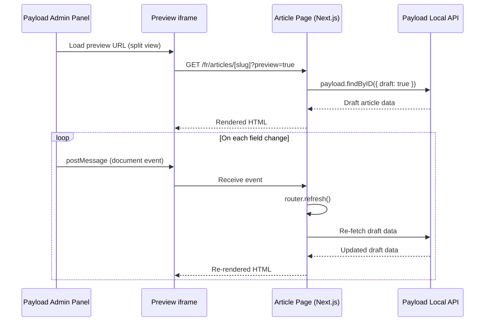

# Story 4.3 - Live Preview

**Epic**: Epic 4 - Article Reading Experience
**Story ID**: 4.3
**Status**: PLANNING
**Created**: 2025-12-11

---

## Story Definition

### User Story

> **En tant qu'** Auteur, **je veux** utiliser le mode "Live Preview" de Payload pour voir mes modifications en temps réel sur le frontend Next.js (ecran scinde), **afin d'** ajuster la mise en page avant publication.

### Source Reference

- **PRD Section**: Epic 4 - Article Reading Experience, Story 4.3
- **EF6**: Live Preview (Exigence Fonctionnelle)

---

## Acceptance Criteria

### From PRD (EF6 - Live Preview)

| ID | Criterion | Priority |
|----|-----------|----------|
| **CA1** | Le Back-office Payload affiche une vue scindee (Split View) avec le formulaire a gauche et le rendu Next.js a droite | MUST |
| **CA2** | La previsualisation se met a jour en temps reel (ou quasi-reel) lors de la modification des champs, sans necessiter de sauvegarde | MUST |

### Technical Acceptance Criteria

| ID | Criterion | Priority |
|----|-----------|----------|
| **TA1** | Installation du package `@payloadcms/live-preview-react` | MUST |
| **TA2** | Configuration de `livePreview.url` dans la collection Articles | MUST |
| **TA3** | Implementation du composant `RefreshRouteOnSave` client-side | MUST |
| **TA4** | Support des URLs bilingues (`/fr/articles/[slug]` et `/en/articles/[slug]`) | MUST |
| **TA5** | Integration dans la page article existante sans casser le rendu normal | MUST |
| **TA6** | Support du draft mode pour previsualiser les articles non publies | MUST |
| **TA7** | Tests E2E validant le fonctionnement du Live Preview | SHOULD |

---

## Functional Requirements

### Live Preview Flow



### URL Generation Strategy

The Live Preview URL must support:

1. **Locale-aware routing**: `/[locale]/articles/[slug]`
2. **Draft mode indicator**: Query parameter or cookie-based
3. **Absolute URL construction**: Using `req.protocol` and `req.host`

```typescript
// Expected URL format
`${baseUrl}/${locale}/articles/${slug}?preview=true`
// Example: https://sebc.dev/fr/articles/mon-article?preview=true
```

---

## Technical Specifications

### Package Dependencies

```json
{
  "dependencies": {
    "@payloadcms/live-preview-react": "^3.x"
  }
}
```

### Collection Configuration

```typescript
// src/collections/Articles.ts
admin: {
  livePreview: {
    url: ({ data, req, locale }) => {
      const baseUrl = process.env.NEXT_PUBLIC_SERVER_URL
      const articleLocale = locale || 'fr'
      return `${baseUrl}/${articleLocale}/articles/${data?.slug}?preview=true`
    },
    breakpoints: [
      { name: 'mobile', width: 375, height: 667, label: 'Mobile' },
      { name: 'tablet', width: 768, height: 1024, label: 'Tablet' },
      { name: 'desktop', width: 1440, height: 900, label: 'Desktop' },
    ],
  },
}
```

### RefreshRouteOnSave Component

```typescript
// src/components/live-preview/RefreshRouteOnSave.tsx
'use client'

import { RefreshRouteOnSave as PayloadLivePreview } from '@payloadcms/live-preview-react'
import { useRouter } from 'next/navigation'
import React from 'react'

export const RefreshRouteOnSave: React.FC<{
  serverURL: string
}> = ({ serverURL }) => {
  const router = useRouter()

  return (
    <PayloadLivePreview
      refresh={() => router.refresh()}
      serverURL={serverURL}
    />
  )
}
```

### Article Page Integration

The article page must:

1. Detect preview mode via query parameter
2. Fetch draft data when in preview mode
3. Include `RefreshRouteOnSave` component conditionally
4. Handle both draft and published states

---

## Implementation Constraints

### Cloudflare Workers Compatibility

- All Live Preview code must be Edge-compatible
- No Node.js native dependencies
- Window message handling must work in iframe context

### i18n Considerations

- Preview URLs must respect the active locale
- Fallback locale handling for partial translations
- Localized field changes must trigger refresh

### Security

- Preview mode should only be accessible to authenticated users
- Consider CSRF protection for preview endpoints
- Validate preview tokens if implementing token-based approach

---

## Dependencies

### Internal Dependencies

| Dependency | Status | Notes |
|------------|--------|-------|
| Story 4.1 (Article Rendering) | COMPLETED | Required for content display |
| Story 4.2 (TOC & Progress) | IN PROGRESS | TOC should work in preview |
| Articles Collection | COMPLETED | Will be modified |
| Article Page | COMPLETED | Will be modified |

### External Dependencies

| Dependency | Version | Notes |
|------------|---------|-------|
| `@payloadcms/live-preview-react` | ^3.x | Must match Payload version |
| Next.js App Router | 15.x | For router.refresh() |
| Payload CMS | 3.65.x | Live Preview API support |

---

## Testing Strategy

### Unit Tests

- `RefreshRouteOnSave` component rendering
- URL generation utility function
- Preview mode detection

### Integration Tests

- Article collection Live Preview config validation
- Draft data fetching with authentication

### E2E Tests (Playwright)

```typescript
// Test: Live Preview loads article in iframe
test('Live Preview displays article in split view', async ({ page }) => {
  // 1. Login to admin
  // 2. Navigate to article edit
  // 3. Verify split view is displayed
  // 4. Verify iframe loads article URL
})

// Test: Changes refresh preview
test('Field changes trigger preview refresh', async ({ page }) => {
  // 1. Login to admin
  // 2. Edit article title
  // 3. Verify preview iframe updates
})
```

---

## Risk Assessment

| Risk | Probability | Impact | Mitigation |
|------|-------------|--------|------------|
| iframe CSP restrictions | Medium | High | Configure appropriate headers |
| Message event handling issues | Low | Medium | Thorough testing across browsers |
| Draft/Published state confusion | Medium | Medium | Clear visual indicators |
| Performance with complex content | Low | Low | Debounce refresh on rapid changes |

---

## Definition of Done

- [ ] Live Preview package installed and configured
- [ ] Articles collection has `livePreview` configuration
- [ ] `RefreshRouteOnSave` component implemented
- [ ] Article page supports preview mode with draft fetching
- [ ] Bilingual URLs work correctly in preview
- [ ] Split view displays in Payload admin when editing articles
- [ ] Changes to fields trigger real-time preview updates
- [ ] TypeScript types are correctly maintained
- [ ] No regressions in normal article viewing
- [ ] E2E tests pass for Live Preview functionality
- [ ] Documentation updated

---

## Notes

### Implementation Approach

We will use the **Server-side Live Preview** approach with `RefreshRouteOnSave` rather than `useLivePreview` hook because:

1. Our article page uses React Server Components (RSC)
2. RSC cannot use client-side hooks for data fetching
3. `RefreshRouteOnSave` triggers `router.refresh()` which re-fetches server data

### Breakpoints

Standard breakpoints for preview:
- Mobile: 375x667 (iPhone SE)
- Tablet: 768x1024 (iPad)
- Desktop: 1440x900 (Standard desktop)

### Related Documentation

- Payload Live Preview Docs: https://payloadcms.com/docs/live-preview
- Next.js Draft Mode: https://nextjs.org/docs/app/building-your-application/configuring/draft-mode
